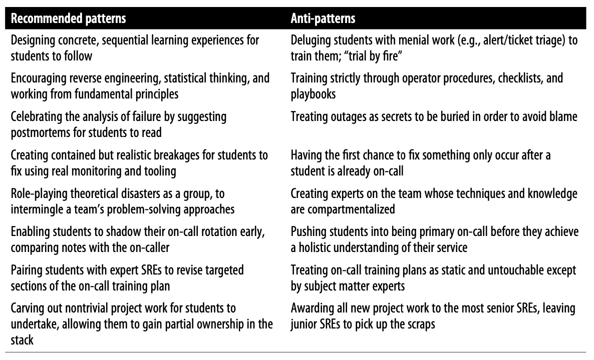
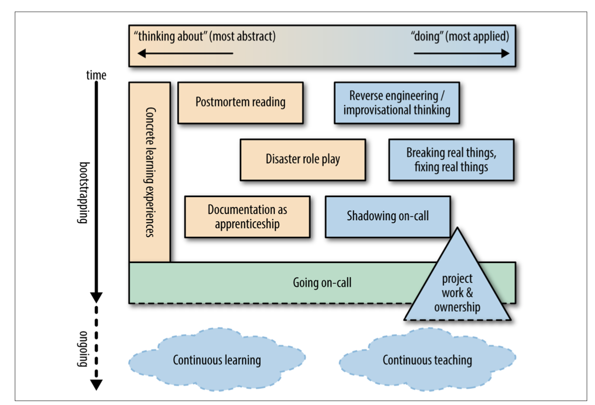

## Accelerating SREs to On-Call and Beyond

How Can I Strap a Jetpack to My Newbies While Keeping Senior SREs Up to Speed?

### You’ve Hired Your Next SRE(s), Now What?

You’ve hired new employees into your organization, and they’re starting as Site Relia‐ bility Engineers. Now you have to train them on the job. Investing up front in the education and technical orientation of new SREs will shape them into better engi‐ neers. Such training will accelerate them to a state of proficiency faster, while making their skill set more robust and balanced.

Successful SRE teams are built on trust—in order to maintain a service consistently and globally, you need to trust that your fellow on-callers know how your system works,1 can diagnose atypical system behaviors, are comfortable with reaching out for help, and can react under pressure to save the day. It is essential, then, but not suffi‐ cient, to think of SRE education through the lens of, “What does a newbie need to learn to go on-call?” Given the requirements regarding trust, you also need to ask questions like:

- How can my existing on-callers assess the readiness of the newbie for on-call?
- How can we harness the enthusiasm and curiosity in our new hires to make sure that existing SREs benefit from it?
- What activities can I commit our team to that benefit everyone’s education, but that everyone will like?

SRE education practices：

The illustration has two axes:
- The x-axis represents the spectrum between different types of work, ranging from abstract to applied activities.
- The y-axis represents time. Read from the top down, new SREs have very little knowledge about the systems and services they’ll be responsible for, so postmor‐ tems detailing how these systems have failed in the past are a good starting point. New SREs can also try to reverse engineer systems from fundamentals, since they’re starting from zero. Once they understand more about their systems and have done some hands-on work, SREs are ready to shadow on-call and to start mending incomplete or out-of-date documentation.

Tips for interpreting this illustration:
- Going on-call is a milestone in a new SRE’s career, after which point learning becomes a lot more nebulous, undefined, and self-directed—hence the dashed lines around activities that happen at or after the SRE goes on-call.
- The triangular shape of project work & ownership indicates that project work starts out small and builds over time, becoming more complex and likely con‐ tinuing well after going on-call.
- Some of these activities and practices are very abstract/passive, and some are very applied/active. A few activities are mixes of both. It’s good to have a variety of learning modalities to suit different learning styles.
- For maximum effect, training activities and practices should be appropriately paced: some are appropriate to undertake straightaway, some should happen right before an SRE officially goes on-call, and some should be continual and ongoing even by seasoned SREs. Concrete learning experiences should happen for the entire time leading up to the SRE going on-call.

### Initial Learning Experiences: The Case for Structure Over Chaos

SRE students will have questions like the following:
- What am I working on?
- How much progress have I made?
- When will these activities accumulate enough experience for me to go on-call?

### Learning Paths That Are Cumulative and Orderly

Put some amount of learning order into your system(s) so that your new SREs see a path before them. Any type of training is better than random tickets and interrupts, but do make a conscious effort to combine the right mix of theory and application: abstract concepts that will recur multiple times in a newbie’s journey should be frontloaded in their education, while the student should also receive hands-on experi‐ ence as soon as practically possible.

Learning about your stack(s) and subsystem(s) requires a starting point. Consider whether it makes more sense to group trainings together by similarity of purpose, or by normal-case order of execution. For example, if your team is responsible for a real- time, user-facing serving stack, consider a curriculum order like the following:

1) How a query enters the system
Networking and datacenter fundamentals, frontend load balancing, proxies, etc.
2) Frontend serving
Application frontend(s), query logging, user experience SLO(s), etc.
3) Mid-tier services
Caches, backend load balancing
4) Infrastructure
Backends, infrastructure, and compute resources
5) Tying it all together
Debugging techniques, escalation procedures, and emergency scenarios

Questions about the inner workings of your service might look similar to the following:

- Which backends of this server are considered “in the critical path,” and why?
- What aspects of this server could be simplified or automated?
- Where do you think the first bottleneck is in this architecture? If that bottleneck were to be saturated, what steps could you take to alleviate it?

#### Targeted Project Work, Not Menial Work

Early opportunities for ownership are standard across Google in general: all engineers are given a starter project that’s meant to provide a tour through the infrastructure sufficient to enable them to make a small but useful contribution early. Having the new SRE split time between learning and project work will also give them a sense of purpose and productivity, which would not happen if they spent time only on learning or project work. Several starter project patterns that seem to work well include:

- Making a trivial user-visible feature change in a serving stack, and subsequently shepherding the feature release all the way through to production. Understand‐ ing both the development toolchain and the binary release process encourages empathy for the developers.
- Adding monitoring to your service where there are currently blind spots. The newbie will have to reason with the monitoring logic, while reconciling their understanding of a system with how it actually (mis)behaves.
- Automating a pain point that isn’t quite painful enough to have been automated already, providing the new SRE with an appreciation for the value SREs place on removing toil from our day-to-day operations.

#### Creating Stellar Reverse Engineers and Improvisational Thinkers

What kind of engineers are we trying to cre‐ ate? At the scale and complexity at which SREs operate, they cannot afford to merely
be operations-focused, traditional system administrators. In addition to having a large-scale engineering mindset, SREs should exhibit the following characteristics:

- In the course of their jobs, they will come across systems they’ve never seen before, so they need to have strong reverse engineering skills.
- At scale, there will be anomalies that are hard to detect, so they’ll need the ability to think statistically, rather than procedurally, to uncloak problems.
- When standard operating procedures break down, they’ll need to be able to improvise fully.

#### Reverse Engineers: Figuring Out How Things Work

Teach your SREs about the diagnostic and debugging surfaces of your applications and have them practice draw‐ ing inferences from the information these surfaces reveal, so that such behavior becomes reflexive when dealing with future outages.

#### Statistical and Comparative Thinkers: Stewards of the Scientific Method Under Pressure

Because time is often of the utmost importance, the SRE has to effectively and efficiently prune this decision tree. The ability to do so is partially gained through experience, which only comes with time and exposure to a breadth of production systems. This experience must be paired with careful construction of hypotheses that, when proven or disproven, even further narrow down that decision space.

#### Improv Artists: When the Unexpected Happens

Learn‐ ing multiple tools that can solve parts of your problem allows you to practice defense in depth in your own problem-solving behaviors. Being too procedural in the face of an outage, thus forgetting your analytical skills, can be the difference between getting stuck and finding the root cause. A case of bogged-down troubleshooting can be fur‐ ther compounded when an SRE brings too many untested assumptions about the cause of an outage into their decision making. 

#### Tying This Together: Reverse Engineering a Production Service

Undoubtedly the student will miss a few subtle details, which will make for a good discussion. It’s also likely that the senior SRE will learn something from the exercise as well, exposing drifts in their prior understanding of the ever-changing system. Because of the rapid change of production systems, it is important that your team welcome any chance to refamiliarize themselves with a system, including by learning from the newest, rather than oldest, members of the team.

#### Five Practices for Aspiring On-Callers

- A Hunger for Failure: Reading and Sharing Postmortems

Regular readings or presentations on outages, including trigger conditions and miti‐ gation steps, do wonders for building a new SRE’s mental map and understanding of production and on-call response. Postmortems are also excellent fuel for future abstract disaster scenarios.

- Disaster Role Playing

When your disaster RPG is successful, everyone will have learned something: perhaps a new tool or trick, a different perspective on how to solve a problem, or (especially gratifying to new team members) a validation that you could have solved this week’s problem if you had been picked. With some luck, this exercise will inspire teammates to eagerly look forward to next week’s adventure or to ask to become the game master for an upcoming week.

- Break Real Things, Fix Real Things

A newbie can learn much about SRE by reading documentation, postmortems, and taking trainings. Disaster role playing can help get a newbie’s mind into the game. However, the experience derived from hands-on experience breaking and/or fixing
real production systems is even better. There will be plenty of time for hands-on experience once a newbie has gone on-call, but such learning should happen before a new SRE reaches that point. Therefore, provide for such hands-on experiences much earlier in order to develop the student’s reflexive responses for using your company’s tooling and monitoring to approach a developing outage.

This exercise is valued by the Google Search SRE team, whose version of this exercise is called “Let’s burn a search cluster to the ground!” The exercise proceeds as follows:
1. As a group, we discuss what observable performance characteristics might change as we cripple the stack.
2. Before inflicting the planned damage, we poll the participants for their guesses and reasoning about their predictions about how the system will react.
3. We validate assumptions and justify the reasoning behind the behaviors we see.

#### Documentation as Apprenticeship

To the student:
— This doc helps establish the boundaries of the system their team supports.
— By studying this list, the student gains a sense of what systems are most important and why. When they understand the information therein, they can move on to other topics they need to learn, rather than dwelling on learning esoteric details that can be learned over time.

To mentors and managers: Student progress through the learning checklist can be observed. The checklist answers questions such as:
— What sections are you working on today?
— What sections are the most confusing?

To all team members: The doc becomes a social contract by which (upon mas‐ tery) the student joins the ranks of on-call. The learning checklist sets the stan‐ dard that all team members should aspire to and uphold.

#### Shadow On-Call Early and Often

When a page comes in, the new SRE is not the appointed on-caller, a condition which removes any time pressure for the student. They now have a front-row seat to the outage while it unfolds, rather than after the issue is resolved. It may be that the stu‐ dent and the primary on-caller share a terminal session, or sit near each other to readily compare notes. At a time of mutual convenience after the outage is complete, the on-caller can review the reasoning and processes followed for the student’s bene‐ fit. This exercise will increase the shadow on-caller’s retention of what actually occurred.

#### On-Call and Beyond: Rites of Passage, and Practicing Continuing Education

Does learning stop when a student joins the ranks of on-call? Of course not! To remain vigilant as SREs, your team will always need to be active and aware of changes to come. While your attention is elsewhere, portions of your stack may be rearchitec‐ ted and extended, leaving your team’s operational knowledge as historic at best.

Set up a regular learning series for your whole team, where overviews of new and upcoming changes to your stack are given as presentations by the SREs who are shep‐ herding the changes, who can co-present with developers as needed. If you can, record the presentations so that you can build a training library for future students.

