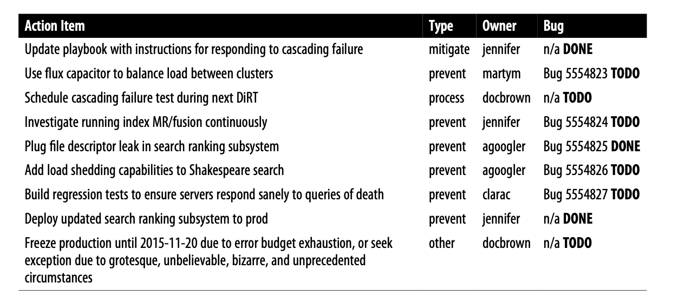

Ultimately, SRE’s goal is to follow a similar course. An SRE team should be as com‐ pact as possible and operate at a high level of abstraction, relying upon lots of backup systems as failsafes and thoughtful APIs to communicate with the systems. At the same time, the SRE team should also have comprehensive knowledge of the systems —how they operate, how they fail, and how to respond to failures—that comes from operating them day-to-day.

## A Collection of Best Practices for Production Services

### Fail Sanely

Sanitize and validate configuration inputs, and respond to implausible inputs by both continuing to operate in the previous state and alerting to the receipt of bad input. Bad input often falls into one of these categories:

- Incorrect data:Validate both syntax and, if possible, semantics. Watch for empty data and partial or truncated data (e.g., alert if the configuration is N% smaller than the previous version).
- Delayed data:This may invalidate current data due to timeouts. Alert well before the data is expected to expire.

Fail in a way that preserves function, possibly at the expense of being overly permis‐ sive or overly simplistic. We’ve found that it’s generally safer for systems to continue functioning with their previous configuration and await a human’s approval before using the new, perhaps invalid, data.

### Progressive Rollouts

Nonemergency rollouts must proceed in stages. Both configuration and binary changes introduce risk, and you mitigate this risk by applying the change to small fractions of traffic and capacity at one time. The size of your service or rollout, as well as your risk profile, will inform the percentages of production capacity to which the rollout is pushed, and the appropriate time frame between stages. It’s also a good idea to perform different stages in different geographies, in order to detect problems related to diurnal traffic cycles and geographical traffic mix differences.

Rollouts should be supervised. To ensure that nothing unexpected is occurring dur‐ ing the rollout, it must be monitored either by the engineer performing the rollout stage or—preferably—a demonstrably reliable monitoring system. If unexpected behavior is detected, roll back first and diagnose afterward in order to minimize Mean Time to Recovery.

### Define SLOs Like a User

#### Error Budgets

Balance reliability and the pace of innovation with error budgets (see “Motivation for Error Budgets” on page 33), which define the acceptable level of failure for a service, over some period; we often use a month. A budget is simply 1 minus a service’s SLO; for instance, a service with a 99.99% availability target has a 0.01% “budget” for unavailability. As long as the service hasn’t spent its error budget for the month through the background rate of errors plus any downtime, the development team is free (within reason) to launch new features, updates, and so on.

If the error budget is spent, the service freezes changes (except urgent security and bug fixes addressing any cause of the increased errors) until either the service has earned back room in the budget, or the month resets. For mature services with an SLO greater than 99.99%, a quarterly rather than monthly budget reset is appropriate, because the amount of allowable downtime is small.

Error budgets eliminate the structural tension that might otherwise develop between SRE and product development teams by giving them a common, data-driven mecha‐ nism for assessing launch risk. They also give both SRE and product development teams a common goal of developing practices and technology that allow faster inno‐ vation and more launches without “blowing the budget.”

### Monitoring

Monitoring may have only three output types:
- Pages:A human must do something now
- Tickets:A human must do something within a few days
- Logging:No one need look at this output immediately, but it’s available for later analysis if needed

### Postmortems

Postmortems should be blameless and focus on process and technology, not people. Assume the people involved in an incident are intelligent, are well intentioned, and were making the best choices they could given the information they had available at the time. It follows that we can’t “fix” the people, but must instead fix their environment: e.g., improving system design to avoid entire classes of problems, making the appropriate information easily available, and automatically validating operational decisions to make it difficult to put systems in dangerous states.

### Capacity Planning

Provision to handle a simultaneous planned and unplanned outage, without making the user experience unacceptable; this results in an "N + 2” configuration, where peak traffic can be handled by N instances (possibly in degraded mode) while the largest 2 instances are unavailable:
- Validate prior demand forecasts against reality until they consistently match. Divergence implies unstable forecasting, inefficient provisioning, and risk of a capacity shortfall.
- Use load testing rather than tradition to establish the resource-to-capacity ratio: a cluster of X machines could handle Y queries per second three months ago, but can it still do so given changes to the system?
- Don’t mistake day-one load for steady-state load. Launches often attract more traffic, while they’re also the time you especially want to put the product’s best foot forward. 

### Overloads and Failure

Services should produce reasonable but suboptimal results if overloaded. For exam‐ ple, Google Search will search a smaller fraction of the index, and stop serving fea‐ tures like Instant to continue to provide good quality web search results when overloaded. Search SRE tests web search clusters beyond their rated capacity to ensure they perform acceptably when overloaded with traffic.

Every client that makes an RPC must implement exponential backoff (with jitter) for retries, to dampen error amplification. Mobile clients are especially troublesome because there may be millions of them and updating their code to fix behavior takes a significant amount of time—possibly weeks—and requires that users install updates.

### SRE Teams

SRE teams should spend no more than 50% of their time on operational work (see Chapter 5); operational overflow should be directed to the product development team. Many services also include the product developers in the on-call rotation and ticket handling, even if there is currently no overflow. This provides incentives to design systems that minimize or eliminate operational toil, along with ensuring that the product developers are in touch with the operational side of the service. A regular production meeting between SREs and the development team (see Chapter 31) is also helpful.

We’ve found that at least eight people need to be part of the on-call team, in order to avoid fatigue and allow sustainable staffing and low turnover. Preferably, those on- call should be in two well-separated geographic locations (e.g., California and Ire‐ land) to provide a better quality of life by avoiding nighttime pages; in this case, six people at each site is the minimum team size.

Expect to handle no more than two events per on-call shift (e.g., per 12 hours): it takes time to respond to and fix outages, start the postmortem, and file the resulting bugs. More frequent events may degrade the quality of response, and suggest that
something is wrong with (at least one of) the system’s design, monitoring sensitivity, and response to postmortem bugs.

Ironically, if you implement these best practices, the SRE team may eventually end up out of practice in responding to incidents due to their infrequency, making a long outage out of a short one. Practice handling hypothetical outages (see “Disaster Role Playing” on page 401) routinely and improve your incident-handling documentation in the process.

## Example Incident State Document

### Shakespeare Sonnet++ Overload: 2015-10-21
#### Incident management info: http://incident-management-cheat-sheet
(Communications lead to keep summary updated.)

 **Summary**: Shakespeare search service in cascading failure due to newly discovered sonnet not in search index.
 
 **Status**: active, incident #465
 
 **Command Post(s)**: #shakespeare on IRC Command Hierarchy (all responders)

**Current Incident Commander**: jennifer 
- Operations lead: docbrown
— Planning lead: jennifer
— Communications lead: jennifer
Next Incident Commander: to be determined

(Update at least every four hours and at handoff of Comms Lead role.)

**Detailed Status** (last updated at 2015-10-21 15:28 UTC by jennifer) Exit Criteria:
- New sonnet added to Shakespeare search corpus TODO
- Within availability (99.99%) and latency (99%ile < 100 ms) SLOs for 30+ minutes TODO

#### TODO list and bugs filed:
- Run MapReduce job to reindex Shakespeare corpus DONE
- Borrow emergency resources to bring up extra capacity DONE
- Enable flux capacitor to balance load between clusters (Bug 5554823) TODO

#### Incident timeline (most recent first: times are in UTC)
- 2015-10-21 15:28 UTC jennifer
- Increasing serving capacity globally by 2x
- 2015-10-21 15:21 UTC jennifer
- Directing all traffic to USA-2 sacrificial cluster and draining traffic from other clusters so they can recover from cascading failure while spinning up more tasks
- MapReduce index job complete, awaiting Bigtable replication to all clusters
- 2015-10-21 15:10 UTC martym
- Adding new sonnet to Shakespeare corpus and starting index MapReduce
- 2015-10-21 15:04 UTC martym
- Obtains text of newly discovered sonnet from shakespeare-discuss@ mailing list
- 2015-10-21 15:01 UTC docbrown
- Incident declared due to cascading failure
- 2015-10-21 14:55 UTC docbrown
- Pager storm, ManyHttp500s in all clusters

## Example Postmortem

Shakespeare Sonnet++ Postmortem (incident #465)

**Date**: 2015-10-21

**Authors**: jennifer, martym, agoogler

**Status**: Complete, action items in progress

**Summary**: Shakespeare Search down for 66 minutes during period of very high inter‐ est in Shakespeare due to discovery of a new sonnet.

**Impact**: Estimated 1.21B queries lost, no revenue impact.

**Root Causes**: Cascading failure due to combination of exceptionally high load and a resource leak when searches failed due to terms not being in the Shakespeare corpus. The newly discovered sonnet used a word that had never before appeared in one of Shakespeare’s works, which happened to be the term users searched for. Under nor‐ mal circumstances, the rate of task failures due to resource leaks is low enough to be unnoticed.

**Trigger**: Latent bug triggered by sudden increase in traffic.

**Resolution**: Directed traffic to sacrificial cluster and added 10x capacity to mitigate cascading failure. Updated index deployed, resolving interaction with latent bug. Maintaining extra capacity until surge in public interest in new sonnet passes. Resource leak identified and fix deployed.

**Detection**: Borgmon detected high level of HTTP 500s and paged on-call. 

**Action Items**:

**Lessons Learned**: 

- What went well: Monitoring quickly alerted us to high rate (reaching ~100%) of HTTP 500s; Rapidly distributed updated Shakespeare corpus to all clusters
- What went wrong: We’re out of practice in responding to cascading failure; We exceeded our availability error budget (by several orders of magnitude) due to the exceptional surge of traffic that essentially all resulted in failures

**Where we got lucky**

- Mailing list of Shakespeare aficionados had a copy of new sonnet available
- Server logs had stack traces pointing to file descriptor exhaustion as cause for crash
- Query-of-death was resolved by pushing new index containing popular search term

**Timeline**
- 14:51 News reports that a new Shakespearean sonnet has been discovered in a Delorean’s glove compartment
- 14:53 Traffic to Shakespeare search increases by 88x after post to /r/shakespeare points to Shakespeare search engine as place to find new sonnet (except we don’t have the sonnet yet)
- ...

## Launch Coordination Checklist

**Architecture**
- Architecture sketch, types of servers, types of requests from clients
- Programmatic client requests
**Machines and datacenters**
- Machines and bandwidth, datacenters, N+2 redundancy, network QoS
- New domain names, DNS load balancing
**Volume estimates, capacity, and performance**
- HTTP traffic and bandwidth estimates, launch “spike,” traffic mix, 6 months out
- Load test, end-to-end test, capacity per datacenter at max latency
- Impact on other services we care most about
- Storage capacity
**System reliability and failover**
- What happens when: Machine dies, rack fails, or cluster goes offline — Network fails between two datacenters
- For each type of server that talks to other servers (its backends):How to detect when backends die, and what to do when they die/ How to terminate or restart without affecting clients or users /  Load balancing, rate-limiting, timeout, retry and error handling behavior
- Data backup/restore, disaster recovery
**Monitoring and server management**
- Monitoring internal state, monitoring end-to-end behavior, managing alerts
- Monitoring the monitoring
- Financially important alerts and logs
- Tips for running servers within cluster environment
- Don’t crash mail servers by sending yourself email alerts in your own server code
**Security**
- Security design review, security code audit, spam risk, authentication, SSL
- Prelaunch visibility/access control, various types of blacklists
**Automation and manual tasks**
- Methods and change control to update servers, data, and configs
- Release process, repeatable builds, canaries under live traffic, staged rollouts
**Growth issues**
- Spare capacity, 10x growth, growth alerts
- Scalability bottlenecks, linear scaling, scaling with hardware, changes needed
- Caching, data sharding/resharding
**External dependencies**
- Third-party systems, monitoring, networking, traffic volume, launch spikes
- Graceful degradation, how to avoid accidentally overrunning third-party services
- Playing nice with syndicated partners, mail systems, services within Google
**Schedule and rollout planning**
- Hard deadlines, external events, Mondays or Fridays
- Standard operating procedures for this service, for other services

#### Example Production Meeting Minutes

**Date**: 2015-10-23

**Attendees**: agoogler, clarac, docbrown, jennifer, martym Announcements:
- Major outage (#465), blew through error budget

**Previous Action Item Review**
- Certify Goat Teleporter for use with cattle (bug 1011101)
- Nonlinearities in mass acceleration now predictable, should be able to target accurately in a few days.

**Outage Review**

 New Sonnet (outage 465)
- 1.21B queries lost due to cascading failure after interaction between latent bug (leaked file descriptor on searches with no results) + not having new sonnet in corpus + unprecedented & unexpected traffic volume
- File descriptor leak bug fixed (bug 5554825) and deployed to prod
- Looking into using flux capacitor for load balancing (bug 5554823) and using load shedding (bug 5554826) to prevent recurrence
- Annihilated availability error budget; pushes to prod frozen for 1 month unless docbrown can obtain exception on grounds that event was bizarre & unforeseeable (but consensus is that exception is unlikely)
**Paging Events**
- AnnotationConsistencyTooEventual: paged 5 times this week, likely due to cross-regional replication delay between Bigtables.
- Investigation still ongoing, see bug 4821600
- No fix expected soon, will raise acceptable consistency threshold to reduce unactionable alerts
**Nonpaging Events**
- None
**Monitoring Changes and/or Silences**
- AnnotationConsistencyTooEventual, acceptable delay threshold raised from 60s to 180s, see bug 4821600; TODO(martym).
**Planned Production Changes**
- USA-1 cluster going offline for maintenance between 2015-10-29 and 2015-11-02.
- No response required, traffic will automatically route to other clusters in region.

**Resources**
- Borrowed resources to respond to sonnet++ incident, will spin down additional server instances and return resources next week
- Utilization at 60% of CPU, 75% RAM, 44% disk (up from 40%, 70%, 40% last week)

**Key Service Metrics**
- OK 99ile latency: 88 ms < 100 ms SLO target [trailing 30 days]
- BAD availability: 86.95% < 99.99% SLO target [trailing 30 days] 

**Discussion / Project Updates**
- Project Molière launching in two weeks.

**New Action Items**
- TODO(martym): Raise AnnotationConsistencyTooEventual threshold.
- TODO(docbrown): Return instance count to normal and return resources.

## Example Incident State Document

