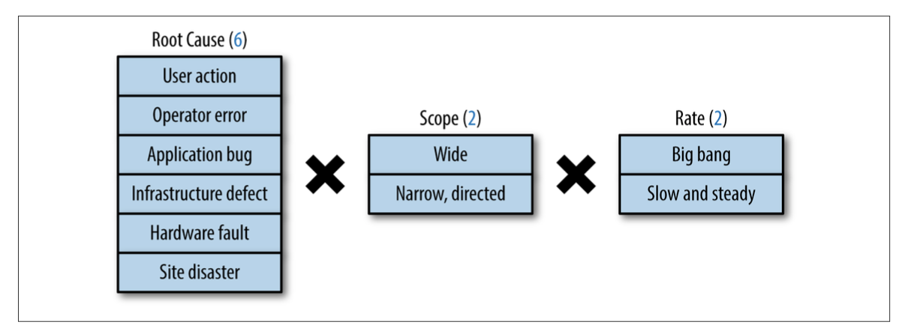
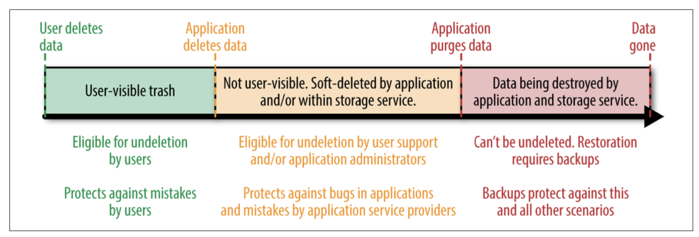

## Data Integrity: What You Read Is What You Wrote

What is “data integrity”? When users come first, data integrity is whatever users think it is.

We might say data integrity is a measure of the accessibility and accuracy of the data‐ stores needed to provide users with an adequate level of service. 
But this definition is insufficient.

When considering data integrity, what matters is that services in the cloud remain accessible to users. User access to data is especially important.

### Data Integrity’s Strict Requirements

User access to data is espe‐ cially important, so this access should remain in perfect shape.

In an alternate universe, suppose the corruption were immediately detected before users were affected and that the artifact was removed, fixed, and returned to service within half an hour. Ignoring any other downtime during that 30 minutes, such an object would be 99.99% available that year.

### Choosing a Strategy for Superior Data Integrity

Most cloud computing applications seek to optimize for some combination of uptime, latency, scale, velocity, and privacy. To provide a working definition for each of these terms:

- Uptime: Also referred to as availability, the proportion of time a service is usable by its users.
- Latency: How responsive a service appears to its users.
- Scale: A service’s volume of users and the mixture of workloads the service can handle before latency suffers or the service falls apart.
- Velocity: How fast a service can innovate to provide users with superior value at reason‐ able cost.
- Privacy: This concept imposes complex requirements. As a simplification, this chapter limits its scope in discussing privacy to data deletion: data must be destroyed within a reasonable time after users delete it.

Many cloud applications continually evolve atop a mixture of ACID and BASE APIs to meet the demands of these five components. BASE allows for higher availability
than ACID, in exchange for a softer distributed consistency guarantee. Specifically, BASE only guarantees that once a piece of data is no longer updated, its value will eventually become consistent across (potentially distributed) storage locations.

When velocity trumps other requirements, the resulting applications rely on an arbi‐ trary collection of APIs that are most familiar to the particular developers working on the application.

### Backups Versus Archives

Traditionally, companies “protect” data against loss by investing in backup strategies. However, the real focus of such backup efforts should be data recovery, which distin‐ guishes real backups from archives. As is sometimes observed: No one really wants to make backups; what people really want are restores.

Archives safekeep data for long periods of time to meet auditing, discovery, and com‐ pliance needs. Data recovery for such purposes generally doesn’t need to complete within uptime requirements of a service. For example, you might need to retain financial transaction data for seven years. To achieve this goal, you could move accu‐ mulated audit logs to long-term archival storage at an offsite location once a month. Retrieving and recovering the logs during a month-long financial audit may take a week, and this weeklong time window for recovery may be acceptable for an archive.

On the other hand, when disaster strikes, data must be recovered from real backups quickly, preferably well within the uptime needs of a service. Otherwise, affected users are left without useful access to the application from the onset of the data integ‐ rity issue until the completion of the recovery effort.

It’s also important to consider that because the most recent data is at risk until safely backed up, it may be optimal to schedule real backups (as opposed to archives) to occur daily, hourly, or more frequently, using full and incremental or continuous (streaming) approaches.

### Requirements of the Cloud Environment in Perspective

Cloud environments introduce a unique combination of technical challenges:
- If the environment uses a mixture of transactional and nontransactional backup and restore solutions, recovered data won’t necessarily be correct.
- If services must evolve without going down for maintenance, different versions of business logic may act on data in parallel.
- If interacting services are versioned independently, incompatible versions of dif‐ ferent services may interact momentarily, further increasing the chance of acci‐ dental data corruption or data loss.

In addition, in order to maintain economy of scale, service providers must provide only a limited number of APIs. These APIs must be simple and easy to use for the vast majority of applications, or few customers will use them. At the same time, the APIs must be robust enough to understand the following:
- Data locality and caching
- Local and global data distribution
- Strong and/or eventual consistency
- Data durability, backup, and recovery

### Google SRE Objectives in Maintaining Data Integrity and Availability

While SRE’s goal of “maintaining integrity of persistent data” is a good vision, we thrive on concrete objectives with measurable indicators. SRE defines key metrics that we use to set expectations for the capabilities of our systems and processes through tests and to track their performance during an actual event.

#### Data Integrity Is the Means; Data Availability Is the Goal

Data integrity refers to the accuracy and consistency of data throughout its lifetime. Users need to know that information will be correct and won’t change in some unexpected way from the time it’s first recorded to the last time it’s observed.

From the user’s point of view, data integrity without expected and regular data availability is effectively the same as having no data at all.

#### Delivering a Recovery System, Rather Than a Backup System

Making backups is a classically neglected, delegated, and deferred task of system administration. Backups aren’t a high priority for anyone—they’re an ongoing drain on time and resources, and yield no immediate visible benefit. For this reason, a lack of diligence in implementing a backup strategy is typically met with a sympathetic eye roll. One might argue that, like most measures of protection against low-risk dangers, such an attitude is pragmatic. The fundamental problem with this lackadaisical strat‐ egy is that the dangers it entails may be low risk, but they are also high impact. When your service’s data is unavailable, your response can make or break your service, product, and even your company.

We don’t make teams “practice” their backups, instead:
- Teams define service level objectives (SLOs) for data availability in a variety of failure modes.
- A team practices and demonstrates their ability to meet those SLOs.

#### Types of Failures That Lead to Data Loss

There are 24 distinct types of failures when the 3 factors can occur in any combination. You should consider each of these potential failures when designing a data integrity program. The factors of data integrity failure modes are as follows:

- Root cause: An unrecoverable loss of data may be caused by a number of factors: user action, operator error, application bugs, defects in infrastructure, faulty hardware, or site catastrophes.
- Scope: Some losses are widespread, affecting many entities. Some losses are narrow and directed, deleting or corrupting data specific to a small subset of users.
- Rate: Some data losses are a big bang event (for example, 1 million rows are replaced by only 10 rows in a single minute), whereas some data losses are creeping (for example, 10 rows of data are deleted every minute over the course of weeks).

To recover from such scenarios, a large and successful application needs to retrieve data for perhaps millions of users spread across days, weeks, or months. The application may also need to recover each affected artifact to a unique point in time. This data recovery scenario is called “point-in-time recovery” outside Google, and “time- travel” inside Google.

A backup and recovery solution that provides point-in-time recovery for an application across its ACID and BASE datastores while meeting strict uptime, latency, scalability, velocity, and cost goals is a chimera today!

Solving this problem with your own engineers entails sacrificing velocity. Many projects compromise by adopting a tiered backup strategy without point-in-time recovery. For instance, the APIs beneath your application may support a variety of data recovery mechanisms. Expensive local “snapshots” may provide limited protection from application bugs and offer quick restoration functionality, so you might retain a few days of such local “snapshots,” taken several hours apart. Cost-effective full and incremental copies every two days may be retained longer. Point-in-time recovery is a very nice feature to have if one or more of these strategies support it.

Consider the data recovery options provided by the cloud APIs you are about to use. Trade point-in-time recovery against a tiered strategy if necessary, but don’t resort to not using either! If you can have both features, use both features. Each of these features (or both) will be valuable at some point.

#### Challenges of Maintaining Data Integrity Deep and Wide

In designing a data integrity program, it’s important to recognize that replication and redundancy are not recoverability.

**Scaling issues: Fulls, incrementals, and the competing forces of backups and restores**

A classic but flawed response to the question “Do you have a backup?” is “We have something even better than a backup—replication!” Replication provides many bene‐ fits, including locality of data and protection from a site-specific disaster, but it can’t protect you from many sources of data loss. Datastores that automatically sync multiple replicas guarantee that a corrupt database row or errant delete are pushed to all of your copies, likely before you can isolate the problem.

Thus, we see that diversity is key: protecting against a failure at layer X requires stor‐ ing data on diverse components at that layer. Media isolation protects against media flaws: a bug or attack in a disk device driver is unlikely to affect tape drives. If we could, we’d make backup copies of our valuable data on clay tablets.

The forces of data freshness and restore completion compete against comprehensive protection. The further down the stack you push a snapshot of your data, the longer it takes to make a copy, which means that the frequency of copies decreases. At the database level, a transaction may take on the order of seconds to replicate. Exporting a database snapshot to the filesystem underneath may take 40 minutes. A full backup of the underlying filesystem may take hours.

**Retention**

While it’s likely that you or your customers will quickly notice the sudden emptying of an entire database, it might take days for a more gradual loss of data to attract the
right person’s attention. Restoring the lost data in the latter scenario requires snap‐ shots taken further back in time. When reaching back this far, you’ll likely want to merge the restored data with the current state. Doing so significantly complicates the restore process.

### How Google SRE Faces the Challenges of Data Integrity

#### The 24 Combinations of Data Integrity Failure Modes

Figure illustrates an object’s journey from soft deletion to destruction, and the data recovery strategies that should be employed along this journey to ensure defense in depth.

The first layer is soft deletion (or “lazy deletion” in the case of developer API offer‐ ings), which has proven to be an effective defense against inadvertent data deletion scenarios. The second line of defense is backups and their related recovery methods. The third and final layer is regular data validation, covered in “Third Layer: Early Detection” on page 356. Across all these layers, the presence of replication is occasion‐ ally useful for data recovery in specific scenarios (although data recovery plans should not rely upon replication).

#### First Layer: Soft Deletion

When velocity is high and privacy matters, bugs in applications account for the vast majority of data loss and corruption events. In fact, data deletion bugs may become so common that the ability to undelete data for a limited time becomes the primary line of defense against the majority of otherwise permanent, inadvertent data loss.

In a lazy deletion scenario, data that is deleted by a cloud application becomes immediately inaccessible to the application, but is preserved by the cloud service provider for up to a few weeks before destruc‐ tion. Lazy deletion isn’t advisable in all defense in depth strategies: a long lazy dele‐ tion period is costly in systems with much short-lived data, and impractical in systems that must guarantee destruction of deleted data within a reasonable time frame (i.e., those that offer privacy guarantees).

To sum up the first layer of defense in depth:
- A trash folder that allows users to undelete data is the primary defense against user error.
- Soft deletion is the primary defense against developer error and the secondary defense against user error.
- In developer offerings, lazy deletion is the primary defense against internal devel‐ oper error and the secondary defense against external developer error.

#### Second Layer: Backups and Their Related Recovery Methods

Backups and data recovery are the second line of defense after soft deletion. The most important principle in this layer is that backups don’t matter; what matters is recov‐ ery. The factors supporting successful recovery should drive your backup decisions, not the other way around.

In other words, the scenarios in which you want your backups to help you recover should dictate the following:
- Which backup and recovery methods to use
- How frequently you establish restore points by taking full or incremental back‐ ups of your data
- Where you store backups
- How long you retain backups

How much recent data can you afford to lose during a recovery effort? The less data you can afford to lose, the more serious you should be about an incremental backup strategy. 

Even if money isn’t a limitation, frequent full backups are expensive in other ways. Most notably, they impose a compute burden on the live datastores of your service while it’s serving users, driving your service closer to its scalability and performance limits. To ease this burden, you can take full backups during off-peak hours, and then a series of incremental backups when your service is busier.

It is expensive to move large amounts of data to and from tiers. On the other hand, storage capacity at the later tiers does not contend with growth of the live production storage instances of your service. As a result, backups in these tiers tend to be taken less frequently but retained longer.

#### Overarching Layer: Replication

In an ideal world, every storage instance, including the instances containing your backups, would be replicated. During a data recovery effort, the last thing you want is to discover is that your backups themselves lost the needed data or that the datacenter containing the most useful backup is under maintenance.

#### 1T Versus 1E: Not “Just” a Bigger Backup

Processes and practices applied to volumes of data measured in T (terabytes) don’t scale well to data measured in E (exabytes). Validating, copying, and performing round-trip tests on a few gigabytes of structured data is an interesting problem. How‐ ever, assuming that you have sufficient knowledge of your schema and transaction model, this exercise doesn’t present any special challenges. You typically just need to
procure the machine resources to iterate over your data, perform some validation logic, and delegate enough storage to hold a few copies of your data.

The most common and largely effective technique used to back up massive amounts of data is to establish “trust points” in your data—portions of your stored data that are verified after being rendered immutable, usually by the passage of time. Once we know that a given user profile or transaction is fixed and won’t be subject to further change, we can verify its internal state and make suitable copies for recovery pur‐ poses. You can then make incremental backups that only include data that has been modified or added since your last backup. This technique brings your backup time in line with your “mainline” processing time, meaning that frequent incremental back‐ ups can save you from the 80-year monolithic verify and copy job.

Another way we can reduce the wall time of our copying and verification jobs is to distribute the load. If we shard our data well, it’s possible to run N tasks in parallel, with each task responsible for copying and verifying 1/Nth of our data. Doing so requires some forethought and planning in the schema design and the physical deployment of our data in order to:

- Balance the data correctly
- Ensure the independence of each shard
- Avoid contention among the concurrent sibling tasks

#### Third Layer: Early Detection

“Bad” data doesn’t sit idly by, it propagates. References to missing or corrupt data are copied, links fan out, and with every update the overall quality of your datastore goes down. Subsequent dependent transactions and potential data format changes make restoring from a given backup more difficult as the clock ticks. The sooner you know about a data loss, the easier and more complete your recovery can be.

**Challenges faced by cloud developers**

In high-velocity environments, cloud application and infrastructure services face many data integrity challenges at runtime, such as:
- Referential integrity between datastores
- Schema changes
- Aging code
- Zero-downtime data migrations
- Evolving integration points with other services

Without conscious engineering effort to track emerging relationships in its data, the data quality of a successful and growing service degrades over time.

To complicate this problem, in order to recover from low-grade data corruption or deletion scenarios, we must recover different subsets of data to different restore points using different backups, while changes to code and schema may render older backups ineffective in high-velocity environments.

**Out-of-band data validation** 

To prevent data quality from degrading before users’ eyes, and to detect low-grade data corruption or data loss scenarios before they become unrecoverable, a system of out-of-band checks and balances is needed both within and between an application’s datastores.

Out-of-band data validation is tricky to implement correctly. When too strict, even simple, appropriate changes cause validation to fail. As a result, engineers abandon data validation altogether. If the data validation isn’t strict enough, user experience– affecting data corruption can slip through undetected. To find the right balance, only validate invariants that cause devastation to users.

Google Compute Storage is another example of the challenges scale entails to data validation. When its out-of-band validators could no longer finish within a day, Compute Storage engineers had to devise a more efficient way to verify its metadata than use of brute force alone. Similar to its application in data recovery, a tiered strat‐ egy can also be useful in out-of-band data validation. As a service scales, sacrifice rigor in daily validators. Make sure that daily validators continue to catch the most disastrous scenarios within 24 hours, but continue with more rigorous validation at reduced frequency to contain costs and latency.

For example, on-call engineers for Gmail are provided with:
- A suite of playbook entries describing how to respond to a validation failure alert
- A BigQuery-like investigation tool
- A data validation dashboard

Effective out-of-band data validation demands all of the following:
- Validation job management
- Monitoring, alerts, and dashboards
- Rate-limiting features
- Troubleshooting tools
- Production playbooks
- Data validation APIs that make validators easy to add and refactor

The majority of small engineering teams operating at high velocity can’t afford to design, build, and maintain all of these systems. If they are pressured to do so, the result is often fragile, limited, and wasteful one-offs that fall quickly into disrepair. Therefore, structure your engineering teams such that a central infrastructure team provides a data validation framework for multiple product engineering teams. The central infrastructure team maintains the out-of-band data validation framework, while the product engineering teams maintain the custom business logic at the heart of the validator to keep pace with their evolving products.

#### Knowing That Data Recovery Will Work

If you discover that your restore process is broken before you need to rely upon it, you can address the vulnerability before you fall victim to it: you can take another backup, provision additional resources, and change your SLO. But to take these actions proactively, you first have to know they’re needed. To detect these vulnerabili‐ ties:
- Continuously test the recovery process as part of your normal operations
- Set up alerts that fire when a recovery process fails to provide a heartbeat indica‐ tion of its success

Remember that you only know that you can recover your recent state if you actually do so.

The aspects of your recovery plan you should confirm are myriad:
- Are your backups valid and complete, or are they empty?
- Do you have sufficient machine resources to run all of the setup, restore, and post-processing tasks that comprise your recovery?
- Does the recovery process complete in reasonable wall time?
- Are you able to monitor the state of your recovery process as it progresses?
- Are you free of critical dependencies on resources outside of your control, such as access to an offsite media storage vault that isn’t available 24/7?

Failures are inevitable. If you wait to discover them when you’re under the gun, fac‐ ing a real data loss, you’re playing with fire. If testing forces the failures to happen before actual catastrophe strikes, you can fix problems before any harm comes to fruition.

### General Principles of SRE as Applied to Data Integrity

#### Beginner’s Mind
Large-scale, complex services have inherent bugs that can’t be fully grokked. Never think you understand enough of a complex system to say it won’t fail in a certain way. Trust but verify, and apply defense in depth.

#### Trust but Verify

Any API upon which you depend won’t work perfectly all of the time. It’s a given that regardless of your engineering quality or rigor of testing, the API will have defects. Check the correctness of the most critical elements of your data using out-of-band data validators, even if API semantics suggest that you need not do so.

#### Hope Is Not a Strategy
System components that aren’t continually exercised fail when you need them most. Prove that data recovery works with regular exercise, or data recovery won’t work. Humans lack discipline to continually exercise system components, so automation is your friend.

#### Defense in Depth

Even the most bulletproof system is susceptible to bugs and operator error. In order for data integrity issues to be fixable, services must detect such issues quickly. Every strategy eventually fails in changing environments. 

### Conclusion

Data availability must be a foremost concern of any data-centric system. Rather than focusing on the means to the end, Google SRE finds it useful to borrow a page from test-driven development by proving that our systems can maintain data availability with a predicted maximum down time. The means and mechanisms that we use to achieve this end goal are necessary evils. By keeping our eyes on the goal, we avoid falling into the trap in which “The operation was a success, but the system died.”

Recognizing that not just anything can go wrong, but that everything will go wrong is a significant step toward preparation for any real emergency. A matrix of all possible combinations of disasters with plans to address each of these disasters permits you to sleep soundly for at least one night; keeping your recovery plans current and exer‐ cised permits you to sleep the other 364 nights of the year.

As you get better at recovering from any breakage in reasonable time N, find ways to whittle down that time through more rapid and finer-grained loss detection, with the goal of approaching N = 0. You can then switch from planning recovery to planning prevention, with the aim of achieving the holy grail of all the data, all the time. Ach‐ ieve this goal, and you can sleep on the beach on that well-deserved vacation.

