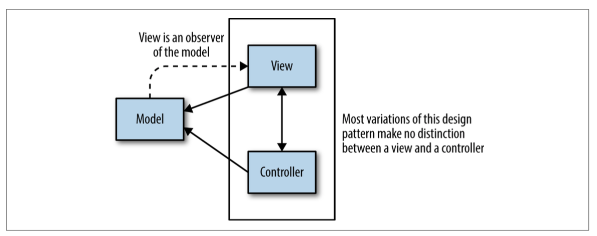
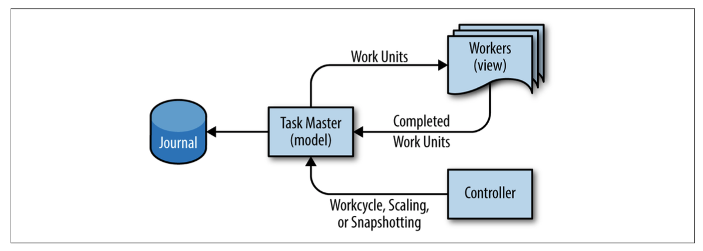
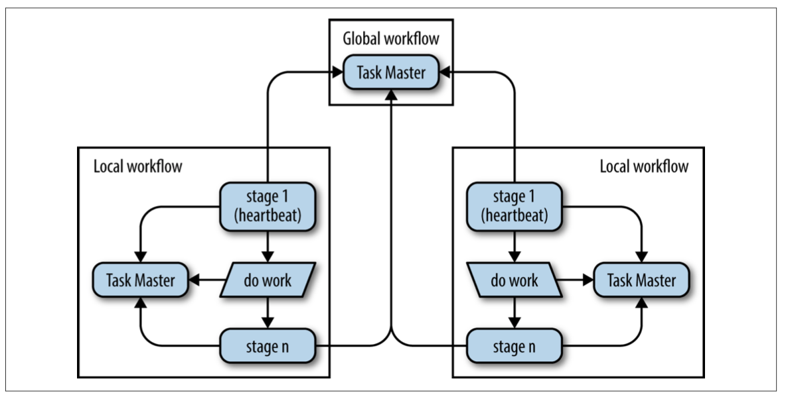

## Data Processing Pipelines

A fresh take on the leader-follower model is presented as a more reliable and better-scaling alternative to the periodic pipeline for processing Big Data.

### Origin of the Pipeline Design Pattern

The classic approach to data processing is to write a program that reads in data, transforms it in some desired way, and outputs new data. Typically, the program is scheduled to run under the control of a periodic scheduling program such as cron. This design pattern is called a data pipeline. 

### Initial Effect of Big Data on the Simple Pipeline Pattern

Programs that perform periodic or continuous transformations on Big Data are usu‐ ally referred to as “simple, one-phase pipelines.”

Given the scale and processing complexity inherent to Big Data, programs are typi‐ cally organized into a chained series, with the output of one program becoming the input to the next. There may be varied rationales for this arrangement, but it is typi‐ cally designed for ease of reasoning about the system and not usually geared toward operational efficiency. Programs organized this way are called multiphase pipelines, because each program in the chain acts as a discrete data processing phase.

The number of programs chained together in series is a measurement known as the depth of a pipeline. Thus, a shallow pipeline may only have one program with a corre‐ sponding pipeline depth measurement of one, whereas a deep pipeline may have a pipeline depth in the tens or hundreds of programs.

### Challenges with the Periodic Pipeline Pattern

Periodic pipelines are generally stable when there are sufficient workers for the vol‐ ume of data and execution demand is within computational capacity. In addition, instabilities such as processing bottlenecks are avoided when the number of chained jobs and the relative throughput between jobs remain uniform.

However, the collective SRE experience has been that the periodic pipeline model is fragile. We discovered that when a periodic pipeline is first installed with worker siz‐ ing, periodicity, chunking technique, and other parameters carefully tuned, perfor‐ mance is initially reliable. However, organic growth and change inevitably begin to stress the system, and problems arise. Examples of such problems include jobs that exceed their run deadline, resource exhaustion, and hanging processing chunks that entail corresponding operational load.

### Trouble Caused By Uneven Work Distribution

The “hanging chunk” problem can result when resources are assigned due to differ‐ ences between machines in a cluster or overallocation to a job. This problem arises due to the difficulty of some real-time operations on streams such as sorting “steam‐ ing” data. The pattern of typical user code is to wait for the total computation to com‐ plete before progressing to the next pipeline stage, commonly because sorting may be involved, which requires all data to proceed. That can significantly delay pipeline completion time, because completion is blocked on the worst-case performance as dictated by the chunking methodology in use.

### Drawbacks of Periodic Pipelines in Distributed Environments
    
Big Data periodic pipelines are widely used at Google, and so Google’s cluster man‐ agement solution includes an alternative scheduling mechanism for such pipelines. This mechanism is necessary because, unlike continuously running pipelines, peri‐ odic pipelines typically run as lower-priority batch jobs. A lower-priority designation works well in this case because batch work is not sensitive to latency in the same way that Internet-facing web services are. In addition, in order to control cost by maxi‐ mizing machine workload, Borg (Google’s cluster management system) assigns batch work to available machines. This priority can result in degraded startup latency, so pipeline jobs can potentially experience open-ended startup delays.

Jobs invoked through this mechanism have a number of natural limitations, resulting in various distinct behaviors. For example, jobs scheduled in the gaps left by user- facing web service jobs might be impacted in terms of availability of low-latency resources, pricing, and stability of access to resources. Execution cost is inversely pro‐ portional to requested startup delay, and directly proportional to resources con‐ sumed. 

Delays of up to a few hours might well be acceptable for pipelines that run daily. However, as the scheduled execution frequency increases, the minimum time between executions can quickly reach the minimum average delay point, placing a lower bound on the latency that a periodic pipeline can expect to attain. Reducing the job execution interval below this effective lower bound simply results in undesirable behavior rather than increased progress. The specific failure mode depends on the batch scheduling policy in use.

#### Monitoring Problems in Periodic Pipelines

For pipelines of sufficient execution duration, having real-time information on run‐ time performance metrics can be as important, if not even more important, than knowing overall metrics. This is because real-time data is important to providing operational support, including emergency response. In practice, the standard moni‐ toring model involves collecting metrics during job execution, and reporting metrics only upon completion. If the job fails during execution, no statistics are provided.

#### “Thundering Herd” Problems

Given a large enough periodic pipeline, for each cycle, potentially thousands of workers immediately start work. If there are too many workers or if the workers are misconfigured or invoked by faulty retry logic, the servers on which they run will be overwhelmed, as will the underlying shared cluster services, and any networking infrastructure that was being used will also be overwhelmed.

#### Moiré Load Pattern

Sometimes the thundering herd problem may not be obvious to spot in isolation. A related problem we call “Moiré load pattern” occurs when two or more pipelines run simultaneously and their execution sequences occasionally overlap, causing them to simultaneously consume a common shared resource. This problem can occur even in continuous pipelines, although it is less common when load arrives more evenly.

#### Introduction to Google Workflow

It’s important to ascertain several details at the outset of designing a system involving a proposed data pipeline. Be sure to scope expected growth trajectory,3 demand for design modifications, expected additional resources, and expected latency requirements from the business.
 
#### Workflow as Model-View-Controller Pattern
 
As shown in Figure, this design pattern divides a given software application into three interconnected parts to separate internal representa‐ tions of information from the ways that information is presented to or accepted from the user.6

Adapting this pattern for Workflow, the model is held in a server called “Task Master.” The Task Master uses the system prevalence pattern to hold all job states in memory for fast availability while synchronously journaling mutations to persistent disk. The view is the workers that continually update the system state transactionally with the master according to their perspective as a subcomponent of the pipeline. Although all pipeline data may be stored in the Task Master, the best performance is usually achieved when only pointers to work are stored in the Task Master, and the actual input and output data is stored in a common filesystem or other storage. Supporting this analogy, the workers are completely stateless and can be discarded at any time. A controller can optionally be added as a third system component to efficiently support
a number of auxiliary system activities that affect the pipeline, such as runtime scal‐ ing of the pipeline, snapshotting, workcycle state control, rolling back pipeline state, or even performing global interdiction for business continuity.

#### Stages of Execution in Workflow

We can increase pipeline depth to any level inside Workflow by subdividing process‐ ing into task groups held in the Task Master. Each task group holds the work corre‐ sponding to a pipeline stage that can perform arbitrary operations on some piece of data. It’s relatively straightforward to perform mapping, shuffling, sorting, splitting, merging, or any other operation in any stage.

The worker consumes work units from a previous stage and produces output units. The output can be an end point or input for some other processing stage. Within the system, it’s easy to guarantee that all work is executed, or at least reflected in perma‐ nent state, exactly once.

#### Workflow Correctness Guarantees

The four Workflow correctness guarantees are:
• Worker output through configuration tasks creates barriers on which to predi‐ cate work.
• All work committed requires a currently valid lease held by the worker.
• Output files are uniquely named by the workers.
• The client and server validate the Task Master itself by checking a server token on every operation.

### Ensuring Business Continuity

Workflow resolves this problem conclusively for continuous processing pipelines. To obtain global consistency, the Task Master stores journals on Spanner, using it as a globally available, globally consistent, but low-throughput filesystem. To determine which Task Master can write, each Task Master uses the distributed lock service called Chubby
to elect the writer, and the result is persisted in Spanner. Finally, clients look up the current Task Master using internal naming services.

