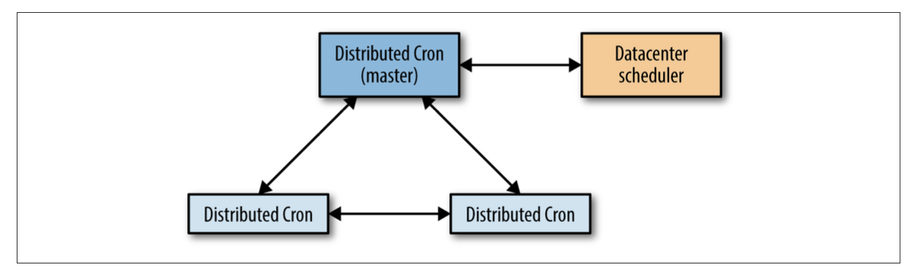
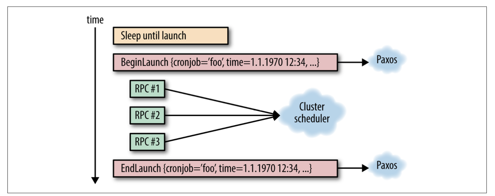

## Distributed Periodic Scheduling with Cron

This chapter describes Google’s implementation of a distributed cron service that serves the vast majority of internal teams that need periodic scheduling of compute jobs.

### Introduction

Cron is designed so that the system administrators and common users of the system can specify commands to run, and when these commands run. Cron executes various
types of jobs, including garbage collection and periodic data analysis. The most com‐ mon time specification format is called “crontab.” This format supports simple inter‐ vals (e.g., “once a day at noon” or “every hour on the hour”). 

### Reliability Perspective

- Cron’s failure domain is essentially just one machine. If the machine is not run‐ ning, neither the cron scheduler nor the jobs it launches can run.
- The only state that needs to persist across crond restarts (including machine reboots) is the crontab configuration itself. The cron launches are fire-and-forget, and crond makes no attempt to track these launches.
- anacron is a notable exception to this. anacron attempts to launch jobs that would have been launched when the system was down. 

### Cron Jobs and Idempotency

This large variety of cron jobs makes reasoning about failure modes difficult: in a sys‐ tem like the cron service, there is no single answer that fits every situation. In general, we favor skipping launches rather than risking double launches, as much as the infra‐ structure allows. This is because recovering from a skipped launch is more tenable than recovering from a double launch. Cron job owners can (and should!) monitor their cron jobs; for example, an owner might have the cron service expose state for its managed cron jobs, or set up independent monitoring of the effect of cron jobs. In case of a skipped launch, cron job owners can take action that appropriately matches the nature of the cron job. However, undoing a double launch, such as the previously mentioned newsletter example, may be difficult or even entirely impossible. There‐ fore, we prefer to “fail closed” to avoid systemically creating bad state.

### Cron at Large Scale

#### Extended Infrastructure

Because moving a process to a different machine can mean loss of any local state stored on the old machine (unless live migration is employed), and the rescheduling time may exceed the smallest scheduling interval of one minute, we need procedures in place to mitigate both data loss and excessive time requirements. To retain local state of the old machine, you might simply persist the state on a distributed filesystem such as GFS, and use this filesystem during startup to identify jobs that failed to launch due to rescheduling. However, this solution falls short in terms of timeliness expectations: if you run a cron job every five minutes, a one- to two-minute delay caused by the total overhead of cron system rescheduling is potentially unacceptably substantial. In this case, hot spares, which would be able to quickly jump in and resume operation, can significantly shorten this time window.

#### Extended Requirements

Deployment at datacenter scale commonly means deployment into containers that enforce isolation. Isolation is necessary because the base expectation is that independent processes running in the same datacenter should not negatively impact each other. In order to enforce that expectation, you should know the quantity of resources you need to acquire up front for any given process you want to run—both for the cron system and the jobs it launches. A cron job may be delayed if the datacenter does not have resources available to match the demands of the cron job. Resource require‐ ments, in addition to user demand for monitoring of cron job launches, means that we need to track the full state of our cron job launches, from the scheduled launch to termination.

### Building Cron at Google

#### Tracking the State of Cron Jobs

We have two options to track the state of cron jobs:
- Store data externally in generally available distributed storage
- Use a system that stores a small volume of state as part of the cron service itself

When designing the distributed cron, we chose the second option. We made this choice for several reasons:
- Distributed filesystems such as GFS or HDFS often cater to the use case of very large files (for example, the output of web crawling programs), whereas the information we need to store about cron jobs is very small. 
- Base services for which outages have wide impact (such as cron) should have very few dependencies. Even if parts of the datacenter go away, the cron service should be able to function for at least some amount of time. But this requirement does not mean that the storage has to be part of the cron process directly (how storage is handled is essentially an implementation detail). 

#### The Use of Paxos

As shown in Figure, the distributed cron uses a single leader job, which is the only replica that can modify the shared state, as well as the only replica that can launch cron jobs. We take advantage of the fact that the variant of Paxos we use, Fast Paxos, uses a leader replica internally as an optimization—the Fast Paxos leader replica also acts as the cron service leader.

If the leader replica dies, the health-checking mechanism of the Paxos group discov‐ ers this event quickly (within seconds). As another cron process is already started up and available, we can elect a new leader. As soon as the new leader is elected, we fol‐ low a leader election protocol specific to the cron service, which is responsible for taking over all the work left unfinished by the previous leader. The leader specific to the cron service is the same as the Paxos leader, but the cron service needs to take additional action upon promotion. The fast reaction time for the leader re-election allows us to stay well within a generally tolerable one-minute failover time.

#### The Roles of the Leader and the Follower

The leader replica is the only replica that actively launches cron jobs. The leader has an internal scheduler that, much like the simple crond described at the beginning of this chapter, maintains the list of cron jobs ordered by their scheduled launch time. The leader replica waits until the scheduled launch time of the first job.

Upon reaching the scheduled launch time, the leader replica announces that it is about to start this particular cron job’s launch, and calculates the new scheduled launch time, just like a regular crond implementation would. Of course, as with regu‐ lar crond, a cron job launch specification may have changed since the last execution, and this launch specification must be kept in sync with the followers as well. Simply identifying the cron job is not enough: we should also uniquely identify the particular launch using the start time; otherwise, ambiguity in cron job launch tracking may occur. (Such ambiguity is especially likely in the case of high-frequency cron jobs, such as those running every minute.)

The follower replicas keep track of the state of the world, as provided by the leader, in order to take over at a moment’s notice if needed. All the state changes tracked by follower replicas are communicated via Paxos, from the leader replica. Much like the leader, followers also maintain a list of all cron jobs in the system, and this list must be kept consistent among the replicas (through the use of Paxos).

Upon receiving notification about a commenced launch, the follower replica updates its local next scheduled launch time for the given cron job. This very important state change (which is performed synchronously) ensures that all cron job schedules within the system are consistent. We keep track of all open launches (launches that have begun but not completed).

If a leader replica dies or otherwise malfunctions (e.g., is partitioned away from the other replicas on the network), a follower should be elected as a new leader. The elec‐ tion must converge faster than one minute, in order to avoid the risk of missing or unreasonably delaying a cron job launch. Once a leader is elected, all open launches (i.e., partial failures) must be concluded. 

Resolving partial failures:

Recall that every cron job launch has two synchronization points:
- When we are about to perform the launch
- When we have finished the launch

In order to determine if the RPC was actually sent, one of the following conditions must be met:
- All operations on external systems, which we may need to continue upon re- election, must be idempotent (i.e., we can safely perform the operations again)
- We must be able to look up the state of all operations on external systems in order to unambiguously determine whether they completed or not

Recall that we track the scheduled launch time when keeping the internal state between the replicas. Similarly, we need to disambiguate our interaction with the datacenter scheduler, also by using the scheduled launch time. For example, consider a short-lived but frequently run cron job. The cron job launches, but before the launch is communicated to all replicas, the leader crashes and an unusually long fail‐ over—long enough that the cron job finishes successfully—takes place. The new leader looks up the state of the cron job, observes its completion, and attempts to launch the job again. Had the launch time been included, the new leader would know that the job on the datacenter scheduler is the result of this particular cron job launch, and this double launch would not have happened.

#### Storing the State

Using Paxos to achieve consensus is only one part of the problem of how to handle the state. Paxos is essentially a continuous log of state changes, appended to synchro‐ nously as state changes occur. This characteristic of Paxos has two implications:
- The log needs to be compacted, to prevent it from growing infinitely
- The log itself must be stored somewhere

In order to prevent the infinite growth of the Paxos log, we can simply take a snap‐ shot of the current state, which means that we can reconstruct the state without need‐ ing to replay all state change log entries leading to the current state. 

In case of lost logs, we only lose the state since the last snapshot. Snapshots are in fact our most critical state—if we lose our snapshots, we essentially have to start from zero again because we’ve lost our internal state. 

We have two main options for storing our data:
- Externally in a generally available distributed storage
- In a system that stores the small volume of state as part of the cron service itself

We store Paxos logs on local disk of the machine where cron service replicas are scheduled. Having three replicas in default operation implies that we have three copies of the logs. We store the snapshots on local disk as well. However, because they are critical, we also back them up onto a distributed filesystem, thus protecting against failures affecting all three machines.

We do not store logs on our distributed filesystem. We consciously decided that los‐ ing logs, which represent a small amount of the most recent state changes, is an acceptable risk. Storing logs on a distributed filesystem can entail a substantial perfor‐ mance penalty caused by frequent small writes. 

In addition to the logs and snapshots stored on the local disk and snapshot backups on the distributed filesystem, a freshly started replica can fetch the state snapshot and all logs from an already running replica over the network. This ability makes replica startup independent of any state on the local machine. Therefore, rescheduling a rep‐ lica to a different machine upon restart (or machine death) is essentially a nonissue for the reliability of the service.

### Running Large Cron

Beware the large and well-known problem of distributed systems: the thundering herd. 

In the ordinary crontab, users specify the minute, hour, day of the month (or week), and month when the cron job should launch, or asterisk to specify any value. Run‐ ning at midnight, daily, would then have crontab specification of "0 0 * * *" (i.e., zero-th minute, zero-th hour, every day of the week, every month, and every day of the week). We also introduced the use of the question mark, which means that any value is acceptable, and the cron system is given the freedom to choose the value. Users choose this value by hashing the cron job configuration over the given time range (e.g., 0..23 for hour), therefore distributing those launches more evenly.

