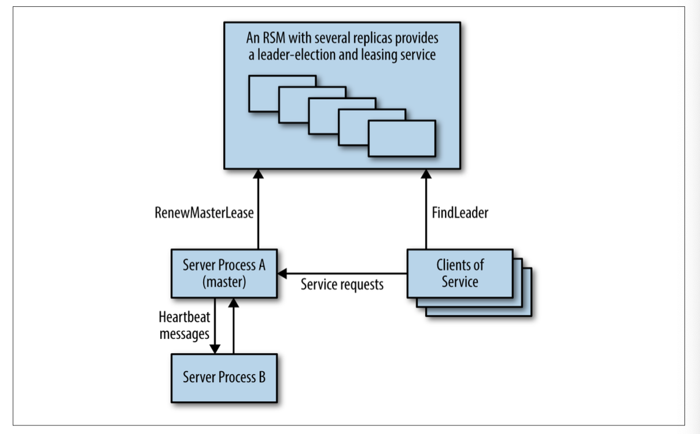
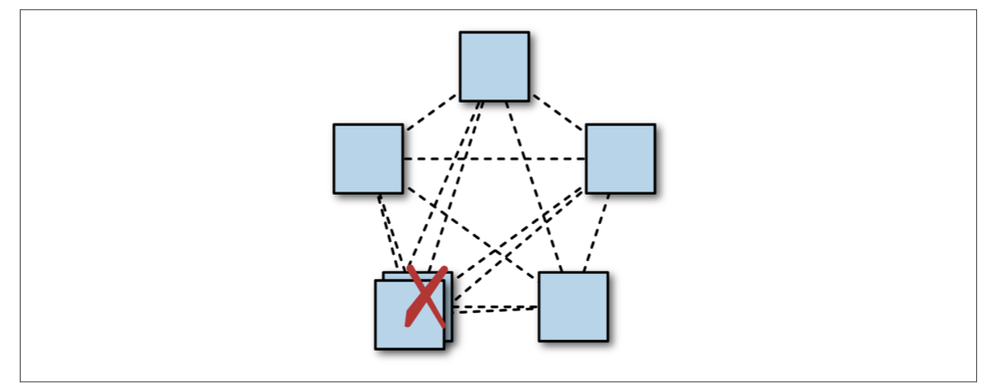

## Managing Critical State: Distributed Consensus for Reliability

Processes crash or may need to be restarted. Hard drives fail. Natural disasters can take out several datacenters in a region. Site Reliability Engineers need to anticipate these sorts of failures and develop strategies to keep systems running in spite of them. These strategies usually entail running such systems across multiple sites. Geographi‐ cally distributing a system is relatively straightforward, but also introduces the need to maintain a consistent view of system state, which is a more nuanced and difficult undertaking.

This figure illustrates a simple model of how a group of processes can achieve a consistent view of system state through distributed consensus.

Whenever you see leader election, critical shared state, or distributed locking, we rec‐ ommend using distributed consensus systems that have been formally proven and tested thoroughly. Informal approaches to solving this problem can lead to outages, and more insidiously, to subtle and hard-to-fix data consistency problems that may pro‐ long outages in your system unnecessarily.

The CAP theorem holds that a distributed system cannot simultaneously have all three of the following properties:
- Consistent views of the data at each node
- Availability of the data at each node
- Tolerance to network partitions

The logic is intuitive: if two nodes can’t communicate (because the network is parti‐ tioned), then the system as a whole can either stop serving some or all requests at some or all nodes (thus reducing availability), or it can serve requests as usual, which results in inconsistent views of the data at each node.

Commercial pres‐ sures often demand high levels of availability, and many applications require consis‐ tent views on their data.

Systems and software engineers are usually familiar with the traditional ACID data‐ store semantics (Atomicity, Consistency, Isolation, and Durability), but a growing number of distributed datastore technologies provide a different set of semantics known as BASE (Basically Available, Soft state, and Eventual consistency). Datastores that support BASE semantics have useful applications for certain kinds of data and can handle large volumes of data and transactions that would be much more costly, and perhaps altogether infeasible, with datastores that support ACID semantics.

Most of these systems that support BASE semantics rely on multimaster replication, where writes can be committed to different processes concurrently, and there is some mechanism to resolve conflicts (often as simple as “latest timestamp wins”). This approach is usually known as eventual consistency. However, eventual consistency can lead to surprising results [Lu15], particularly in the event of clock drift (which is inevitable in distributed systems) or network partitioning.

### Motivating the Use of Consensus: Distributed Systems Coordination Failure

#### Case Study 1: The Split-Brain Problem

A service is a content repository that allows collaboration between multiple users. It uses sets of two replicated file servers in different racks for reliability. The service needs to avoid writing data simultaneously to both file servers in a set, because doing so could result in data corruption (and possibly unrecoverable data).

Each pair of file servers has one leader and one follower. The servers monitor each other via heartbeats. If one file server cannot contact its partner, it issues a STONITH (Shoot The Other Node in the Head) command to its partner node to shut the node down, and then takes mastership of its files. This practice is an industry standard method of reducing split-brain instances, although as we shall see, it is conceptually unsound.

What happens if the network becomes slow, or starts dropping packets? In this sce‐ nario, file servers exceed their heartbeat timeouts and, as designed, send STONITH commands to their partner nodes and take mastership. However, some commands may not be delivered due to the compromised network. File server pairs may now be in a state in which both nodes are expected to be active for the same resource, or where both are down because both issued and received STONITH commands. This results in either corruption or unavailability of data.

The problem here is that the system is trying to solve a leader election problem using simple timeouts. Leader election is a reformulation of the distributed asynchronous consensus problem, which cannot be solved correctly by using heartbeats.

#### Case Study 2: Failover Requires Human Intervention

A highly sharded database system has a primary for each shard, which replicates syn‐ chronously to a secondary in another datacenter. An external system checks the health of the primaries, and, if they are no longer healthy, promotes the secondary to primary. If the primary can’t determine the health of its secondary, it makes itself unavailable and escalates to a human in order to avoid the split-brain scenario seen in Case Study 1.

This solution doesn’t risk data loss, but it does negatively impact availability of data. It also unnecessarily increases operational load on the engineers who run the system, and human intervention scales poorly. This sort of event, where a primary and secon‐ dary have problems communicating, is highly likely to occur in the case of a larger infrastructure problem, when the responding engineers may already be overloaded with other tasks. If the network is so badly affected that a distributed consensus sys‐ tem cannot elect a master, a human is likely not better positioned to do so.

#### Case Study 3: Faulty Group-Membership Algorithms

A system has a component that performs indexing and searching services. When starting, nodes use a gossip protocol to discover each other and join the cluster. The cluster elects a leader, which performs coordination. In the case of a network parti‐ tion that splits the cluster, each side (incorrectly) elects a master and accepts writes and deletions, leading to a split-brain scenario and data corruption.

The problem of determining a consistent view of group membership across a group of processes is another instance of the distributed consensus problem.

In fact, many distributed systems problems turn out to be different versions of dis‐ tributed consensus, including master election, group membership, all kinds of dis‐ tributed locking and leasing, reliable distributed queuing and messaging, and maintenance of any kind of critical shared state that must be viewed consistently across a group of processes. All of these problems should be solved only using dis‐ tributed consensus algorithms that have been proven formally correct, and whose implementations have been tested extensively. Ad hoc means of solving these sorts of problems (such as heartbeats and gossip protocols) will always have reliability prob‐ lems in practice.

### How Distributed Consensus Works

The consensus problem has multiple variants. When dealing with distributed soft‐ ware systems, we are interested in asynchronous distributed consensus, which applies to environments with potentially unbounded delays in message passing. (Synchronous consensus applies to real-time systems, in which dedicated hardware means that mes‐ sages will always be passed with specific timing guarantees.)

Algorithms may deal with Byzantine or non-Byzantine failures. Byzantine failure occurs when a process passes incorrect messages due to a bug or malicious activity, and are comparatively costly to handle, and less often encountered.

In practice, we approach the distributed consensus problem in bounded time by ensuring that the system will have sufficient healthy replicas and network connectiv‐ ity to make progress reliably most of the time. In addition, the system should have backoffs with randomized delays. This setup both prevents retries from causing cas‐ cade effects and avoids the dueling proposers problem described later in this chapter. The protocols guarantee safety, and adequate redundancy in the system encourages liveness.

#### Paxos Overview: An Example Protocol

Paxos operates as a sequence of proposals, which may or may not be accepted by a majority of the processes in the system. If a proposal isn’t accepted, it fails. Each pro‐ posal has a sequence number, which imposes a strict ordering on all of the operations in the system.

In the first phase of the protocol, the proposer sends a sequence number to the acceptors. Each acceptor will agree to accept the proposal only if it has not yet seen a proposal with a higher sequence number. Proposers can try again with a higher sequence number if necessary. Proposers must use unique sequence numbers (draw‐ ing from disjoint sets, or incorporating their hostname into the sequence number, for instance).

If a proposer receives agreement from a majority of the acceptors, it can commit the proposal by sending a commit message with a value.

The strict sequencing of proposals solves any problems relating to ordering of mes‐ sages in the system. The requirement for a majority to commit means that two differ‐ ent values cannot be committed for the same proposal, because any two majorities will overlap in at least one node. Acceptors must write a journal on persistent storage whenever they agree to accept a proposal, because the acceptors need to honor these guarantees after restarting.

Paxos on its own isn’t that useful: all it lets you do is to agree on a value and proposal number once. Because only a quorum of nodes need to agree on a value, any given node may not have a complete view of the set of values that have been agreed to. This limitation is true for most distributed consensus algorithms.

### System Architecture Patterns for Distributed Consensus

Distributed consensus algorithms are low-level and primitive: they simply allow a set of nodes to agree on a value, once. They don’t map well to real design tasks. What makes distributed consensus useful is the addition of higher-level system components such as datastores, configuration stores, queues, locking, and leader election services to provide the practical system functionality that distributed consensus algorithms don’t address. 

Many systems that successfully use consensus algorithms actually do so as clients of some service that implements those algorithms, such as Zookeeper, Consul, and etcd. Zookeeper was the first open source consensus system to gain traction in the industry because it was easy to use, even with applications that weren’t designed to use distributed consensus.

#### Reliable Replicated State Machines

A replicated state machine (RSM) is a system that executes the same set of operations, in the same order, on several processes. RSMs are the fundamental building block of useful distributed systems components and services such as data or configuration storage, locking, and leader election.

Replicated state machines are a system implemented at a logical layer above the consensus algorithm. The consensus algorithm deals with agreement on the sequence of operations, and the RSM executes the operations in that order. Because not every member of the consensus group is necessarily a mem‐ ber of each consensus quorum, RSMs may need to synchronize state from peers. 

#### Reliable Replicated Datastores and Configuration Stores

Reliable replicated datastores are an application of replicated state machines. Replica‐ ted datastores use consensus algorithms in the critical path of their work. Thus, per‐ formance, throughput, and the ability to scale are very important in this type of design. As with datastores built with other underlying technologies, consensus-based datastores can provide a variety of consistency semantics for read operations, which make a huge difference to how the datastore scales. 

Other (nondistributed-consensus–based) systems often simply rely on timestamps to provide bounds on the age of data being returned. Timestamps are highly problem‐ atic in distributed systems because it’s impossible to guarantee that clocks are synchronized across multiple machines. 

#### Highly Available Processing Using Leader Election

Leader election in distributed systems is an equivalent problem to distributed consen‐ sus. Replicated services that use a single leader to perform some specific type of work in the system are very common; the single leader mechanism is a way of ensuring mutual exclusion at a coarse level.

#### Distributed Coordination and Locking Services

A barrier in a distributed computation is a primitive that blocks a group of processes from proceeding until some condition is met (for example, until all parts of one phase of a computation are completed). Use of a barrier effectively splits a distributed com‐ putation into logical phases.

Locks are another useful coordination primitive that can be implemented as an RSM. Consider a distributed system in which worker processes atomically consume some input files and write results. Distributed locks can be used to prevent multiple work‐ ers from processing the same input file. In practice, it is essential to use renewable leases with timeouts instead of indefinite locks, because doing so prevents locks from being held indefinitely by processes that crash. 

#### Reliable Distributed Queuing and Messaging

Queues are a common data structure, often used as a way to distribute tasks between a number of worker processes.

Queuing-based systems can tolerate failure and loss of worker nodes relatively easily. However, the system must ensure that claimed tasks are successfully processed. For that purpose, a lease system (discussed earlier in regard to locks) is recommended instead of an outright removal from the queue. The downside of queuing-based sys‐ tems is that loss of the queue prevents the entire system from operating. Implement‐ ing the queue as an RSM can minimize the risk, and make the entire system far more robust.

### Distributed Consensus Performance

Google’s scale is not an advantage here: in fact, our scale is more of a disadvantage because it introduces two main challenges: our datasets tend to be large and our systems run over a wide geographical distance. Larger datasets multiplied by several replicas rep‐ resent significant computing costs, and larger geographical distances increase latency between replicas, which in turn reduces performance.

Workload may vary in terms of:
- Throughput: the number of proposals being made per unit of time at peak load
- The type of requests: proportion of operations that change state
- The consistency semantics required for read operations
- Request sizes, if size of data payload can vary

Deployment strategies vary, too. For example:
- Is the deployment local area or wide area?
- What kinds of quorum are used, and where are the majority of processes?
- Does the system use sharding, pipelining, and batching?

#### Multi-Paxos: Detailed Message Flow

The Multi-Paxos protocol uses a strong leader process: unless a leader has not yet been elected or some failure occurs, it requires only one round trip from the proposer to a quorum of acceptors to reach consensus. Using a strong leader process is optimal in terms of the number of messages to be passed, and is typical of many consensus protocols.

Figure shows an initial state with a new proposer executing the first Prepare/ Promise phase of the protocol. Executing this phase establishes a new numbered view, or leader term. On subsequent executions of the protocol, while the view remains the same, the first phase is unnecessary because the proposer that established the view can simply send Accept messages, and consensus is reached once a quorum of responses is received (including the proposer itself).

For systems that use a leader process, the leader election process must be tuned care‐ fully to balance the system unavailability that occurs when no leader is present with the risk of dueling proposers. It’s important to implement the right timeouts and backoff strategies. If multiple processes detect that there is no leader and all attempt to become leader at the same time, then none of the processes is likely to succeed (again, dueling proposers). Introducing randomness is the best approach.

#### Scaling Read-Heavy Workloads

In order to guarantee that data being read is up-to-date and consistent with any changes made before the read is performed, it is necessary to do one of the following:
- Perform a read-only consensus operation.
- Read the data from a replica that is guaranteed to be the most up-to-date. 
- Use quorum leases, in which some replicas are granted a lease on all or part of the data in the system, allowing strongly consistent local reads at the cost of some write performance.

#### Quorum Leases

The quorum leasing technique simply grants a read lease on some subset of the repli‐ cated datastore’s state to a quorum of replicas. The lease is for a specific (usually brief) period of time. Any operation that changes the state of that data must be acknowl‐ edged by all replicas in the read quorum. If any of these replicas becomes unavailable, the data cannot be modified until the lease expires.

#### Distributed Consensus Performance and Network Latency

Consensus systems face two major physical constraints on performance when com‐ mitting state changes. One is network round-trip time and the other is time it takes to write data to persistent storage, which will be examined later.

Network round-trip times vary enormously depending on source and destination location, which are impacted both by the physical distance between the source and the destination, and by the amount of congestion on the network. Within a single datacenter, round-trip times between machines should be on the order of a millisec‐ ond. A typical round-trip-time (RTT) within the United States is 45 milliseconds, and from New York to London is 70 milliseconds.

Consensus system performance over a local area network can be comparable to that of an asynchronous leader-follower replication system [Bol11], such as many tradi‐ tional databases use for replication. However, much of the availability benefits of dis‐ tributed consensus systems require replicas to be “distant” from each other, in order to be in different failure domains.

Many consensus systems use TCP/IP as their communication protocol. TCP/IP is connection-oriented and provides some strong reliability guarantees regarding FIFO sequencing of messages. However, setting up a new TCP/IP connection requires a network round trip to perform the three-way handshake that sets up a connection before any data can be sent or received. TCP/IP slow start initially limits the band‐ width of the connection until its limits have been established. Initial TCP/IP window sizes range from 4 to 15 KB.

TCP/IP slow start is probably not an issue for the processes that form a consensus group: they will establish connections to each other and keep these connections open for reuse because they’ll be in frequent communication. However, for systems with a very high number of clients, it may not be practical for all clients to keep a persistent connection to the consensus clusters open, because open TCP/IP connections do consume some resources, e.g., file descriptors, in addition to generating keepalive traffic. This overhead may be an important issue for applications that use very highly sharded consensus-based datastores containing thousands of replicas and an even larger numbers of clients. 

A solution is to use a pool of regional proxies, as shown in Figure, which hold persistent TCP/IP connections to the consensus group in order to avoid the setup overhead over long distances. Proxies may also be a good way to encapsulate sharding and load balancing strategies, as well as discovery of cluster members and leaders.

#### Reasoning About Performance: Fast Paxos

Fast Paxos is a version of the Paxos algorithm designed to improve its per‐ formance over wide area networks. Using Fast Paxos, each client can send Propose messages directly to each member of a group of acceptors, instead of through a leader, as in Classic Paxos or Multi-Paxos. The idea is to substitute one parallel mes‐ sage send from the client to all acceptors in Fast Paxos for two message send opera‐ tions in Classic Paxos:
- One message from the client to a single proposer
- A parallel message send operation from the proposer to the other replicas

#### Stable Leaders

We have seen how Multi-Paxos elects a stable leader to improve performance. 

The leader has the most up-to-date state, but also has several problems:
- All operations that change state must be sent via the leader, a requirement that adds network latency for clients that are not located near the leader.
- The leader process’s outgoing network bandwidth is a system bottleneck. Because the leader’s Accept message contains all of the data related to any proposal, whereas other messages contain only acknowledgments of a num‐ bered transaction with no data payload.
- If the leader happens to be on a machine with performance problems, then the throughput of the entire system will be reduced.

#### Batching

Batching, as described in “Reasoning About Performance: Fast Paxos” on page 301, increases system throughput, but it still leaves replicas idle while they await replies to messages they have sent. The inefficiencies presented by idle replicas can be solved by pipelining, which allows multiple proposals to be in-flight at once. This optimization is very similar to the TCP/IP case, in which the protocol attempts to “keep the pipe full” using a sliding-window approach. Pipelining is normally used in combination with batching.

#### Disk Access

In a datastore, disks have purposes other than maintaining logs: system state is gener‐ ally maintained on disk. Log writes must be flushed directly to disk, but writes for state changes can be written to a memory cache and flushed to disk later, reordered to use the most efficient schedule.

### Deploying Distributed Consensus-Based Systems

#### Number of Replicas

In general, consensus-based systems operate using majority quorums, i.e., a group of 2 f + 1 replicas may tolerate f failures (if Byzantine fault tolerance, in which the sys‐ tem is resistant to replicas returning incorrect results, is required, then 3 f + 1 replicas may tolerate f failures). For non-Byzantine failures, the minimum number of replicas that can be deployed is three—if two are deployed, then there is no tolerance for failure of any process. Three replicas may tolerate one failure. Most system down‐ time is a result of planned maintenance: three replicas allow a system to operate normally when one replica is down for maintenance (assuming that the remaining two replicas can handle system load at an acceptable performance).

There is a relationship between performance and the number of replicas in a system that do not need to form part of a quorum: a minority of slower replicas may lag behind, allowing the quorum of better-performing replicas to run faster (as long as the leader performs well). If replica performance varies significantly, then every fail‐ ure may reduce the performance of the system overall because slow outliers will be required to form a quorum. The more failures or lagging replicas a system can toler‐ ate, the better the system’s performance overall is likely to be.

The issue of cost should also be considered in managing replicas: each replica uses costly computing resources. If the system in question is a single cluster of processes, the cost of running replicas is probably not a large consideration. However, the cost of replicas can be a serious consideration for systems such as Photon [Ana13], which uses a sharded configuration in which each shard is a full group of processes running a consensus algorithm. As the number of shards grows, so does the cost of each addi‐ tional replica, because a number of processes equal to the number of shards must be added to the system.

The decision about the number of replicas for any system is thus a trade-off between the following factors:
- The need for reliability
- Frequency of planned maintenance affecting the system
- Risk
- Performance 
- Cost

#### Location of Replicas

Decisions about where to deploy the processes that comprise a consensus cluster are made based upon two factors: a trade-off between the failure domains that the system should handle, and the latency requirements for the system. Multiple complex issues are at play in deciding where to locate replicas.

A failure domain is the set of components of a system that can become unavailable as a result of a single failure. Example failure domains include the following:
- A physical machine
- A rack in a datacenter served by a single power supply
- Several racks in a datacenter that are served by one piece of networking equipment
- A datacenter that could be rendered unavailable by a fiber optic cable cut
- A set of datacenters in a single geographic area that could all be affected by a sin‐ gle natural disaster such as a hurricane

In general, as the distance between replicas increases, so does the round-trip time between replicas, as well as the size of the failure the system will be able to tolerate. For most consensus systems, increasing the round-trip time between replicas will also increase the latency of operations.

When making decisions about location of replicas, remember that the most impor‐ tant measure of performance is client perception: ideally, the network round-trip time from the clients to the consensus system’s replicas should be minimized. Over a wide area network, leaderless protocols like Mencius or Egalitarian Paxos may have a performance edge, particularly if the consistency constraints of the application mean that it is possible to execute read-only operations on any system replica without per‐ forming a consensus operation.

#### Capacity and Load Balancing

When designing a deployment, you must make sure there is sufficient capacity to deal with load. In the case of sharded deployments, you can adjust capacity by adjusting the number of shards. However, for systems that can read from consensus group mem‐ bers that are not the leader, you can increase read capacity by adding more replicas. Adding more replicas has a cost: in an algorithm that uses a strong leader, adding replicas imposes more load on the leader process, while in a peer-to-peer protocol, adding replicas imposes more load on all processes. However, if there is ample capacity for write operations, but a read-heavy workload is stressing the system, adding replicas may be the best approach.

Adding an extra replica in one region may reduce system availability. Colocating multiple replicas in a single datacenter may reduce system availability: here, there is a quorum without any redundancy remaining.

Colocating leader processes leads to uneven bandwidth utilization.

We’ve already seen the reason that many distributed consensus systems use a leader process to improve performance. However, it’s important to understand that the leader replicas will use more computational resources, particularly outgoing network capacity. This is because the leader sends proposal messages that include the pro‐ posed data, but replicas send smaller messages, usually just containing agreement with a particular consensus transaction ID. Organizations that run highly sharded consensus systems with a very large number of processes may find it necessary to ensure that leader processes for the different shards are balanced relatively evenly across different datacenters. Doing so prevents the system as a whole from being bot‐ tlenecked on outgoing network capacity for just one datacenter, and makes for much greater overall system capacity.

However, this type of deployment could easily be an unintended result of automatic processes in the system that have bearing on how leaders are chosen. For instance:

- Clients will experience better latency for any operations handled via the leader if the leader is located closest to them. An algorithm that attempts to site leaders near the bulk of clients could take advantage of this insight.
- An algorithm might try to locate leaders on machines with the best performance. A pitfall of this approach is that if one of the three datacenters houses faster machines, then a disproportionate amount of traffic will be sent to that datacen‐ ter, resulting in extreme traffic changes should that datacenter go offline. To avoid this problem, the algorithm must also take into account distribution bal‐ ance against machine capabilities when selecting machines.
- A leader election algorithm might favor processes that have been running longer. Longer-running processes are quite likely to be correlated with location if soft‐ ware releases are performed on a per-datacenter basis.

**Quorum composition**

When determining where to locate replicas in a consensus group, it is important to consider the effect of the geographical distribution (or, more precisely, the network latencies between replicas) on the performance of the group.

### Monitoring Distributed Consensus Systems

Experience has shown us that there are certain specific aspects of distributed consensus systems that warrant special attention. These are:

- The number of members running in each consensus group, and the status of each process (healthy or not healthy)
- Persistently lagging replicas
- Whether or not a leader exists
- Number of leader changes
- Consensus transaction number
- Number of proposals seen; number of proposals agreed upon
- Throughput and latency

In order to understand system performance and to help troubleshoot performance issues, you might also monitor the following:
- Latency distributions for proposal acceptance
- Distributions of network latencies observed between parts of the system in differ‐ ent locations
- The amount of time acceptors spend on durable logging
- Overall bytes accepted per second in the system

### Conclusion

If you remember nothing else from this chapter, keep in mind the sorts of problems that distributed consensus can be used to solve, and the types of problems that can arise when ad hoc methods such as heartbeats are used instead of distributed consen‐ sus. Whenever you see leader election, critical shared state, or distributed locking, think about distributed consensus: any lesser approach is a ticking bomb waiting to explode in your systems.

