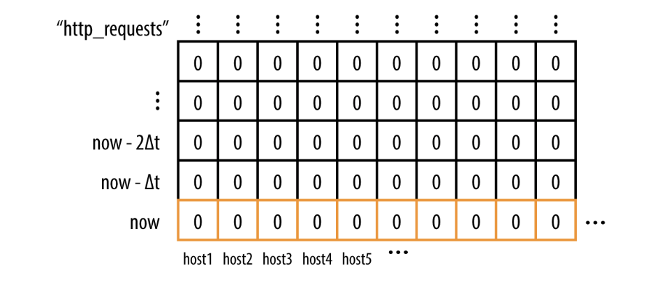
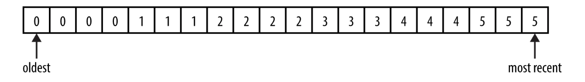
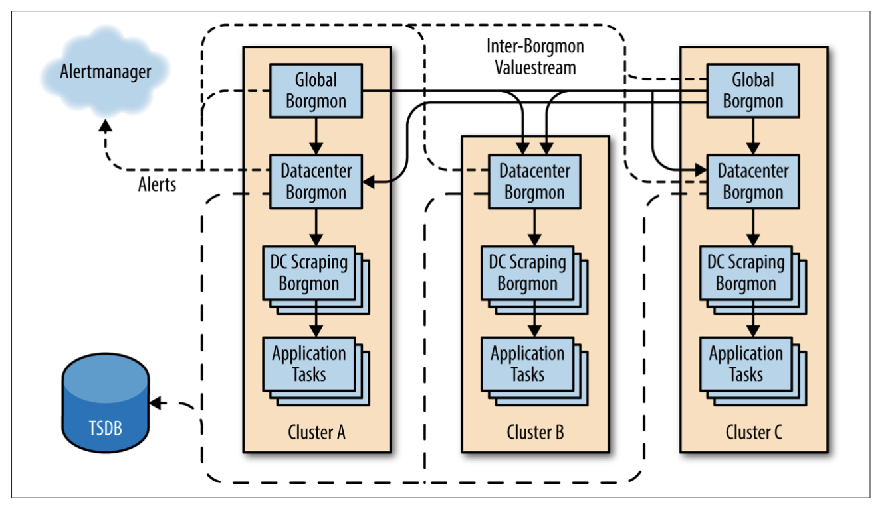

## Practical Alerting from Time-Series Data

Monitoring, the bottom layer of the Hierarchy of Production Needs, is fundamental to running a stable service. Monitoring enables service owners to make rational deci‐ sions about the impact of changes to the service, apply the scientific method to inci‐ dent response, and of course ensure their reason for existence: to measure the service’s alignment with business goals.

Monitoring a very large system is challenging for a couple of reasons:
- The sheer number of components being analyzed
- The need to maintain a reasonably low maintenance burden on the engineers responsible for the system

### The Rise of Borgmon

The data is used both for rendering charts and creating alerts, which are accom‐ plished using simple arithmetic. Because collection is no longer in a short-lived pro‐ cess, the history of the collected data can be used for that alert computation as well.

A Borgmon can collect from other Borgmon,3 so we can build hierarchies that follow the topology of the service, aggregating and summarizing information and discarding some strategically at each level. Typically, a team runs a single Borgmon per cluster, and a pair at the global level. Some very large services shard below the cluster level into many scraper Borgmon, which in turn feed to the cluster-level Borgmon.

### Instrumentation of Applications

The /varz HTTP handler simply lists all the exported variables in plain text, as space- separated keys and values, one per line. A later extension added a mapped variable, which allows the exporter to define several labels on a variable name, and then export a table of values or a histogram. 

In hindsight, it’s apparent that this schemaless textual interface makes the barrier to adding new instrumentation very low, which is a positive for both the software engi‐ neering and SRE teams. However, this has a trade-off against ongoing maintenance; the decoupling of the variable definition from its use in Borgmon rules requires careful change management. In practice, this trade-off has been satisfactory because tools to validate and generate rules have been written as well.

### Collection of Exported Data

Borgmon also records “synthetic” variables for each target in order to identify:
- If the name was resolved to a host and port
- If the target responded to a collection
- If the target responded to a health check
- What time the collection finished

### Storage in the Time-Series Arena

A time-series for errors labeled by the original host each was collected from

A time-series is conceptually a one-dimensional matrix of numbers, progressing through time. As you add permutations of labels to this time-series, the matrix becomes multidimensional.

The in-memory state is archived to an external system known as the Time-Series Database (TSDB). Borgmon can query TSDB for older data and, while slower, TSDB is cheaper and larger than a Borgmon’s RAM.

### Labels and Vectors

Time-series are stored as sequen‐ ces of numbers and timestamps, which are referred to as vectors. Like vectors in linear algebra, these vectors are slices and cross-sections of the multidimensional matrix of data points in the arena. Conceptually the timestamps can be ignored, because the values are inserted in the vector at regular intervals in time—for example, 1 or 10 sec‐ onds or 1 minute apart.

A few label names are declared as important. For the time-series in the time-series database to be identifiable, it must at minimum have the following labels:

- var: The name of the variable
- job: The name given to the type of server being monitored
- service: A loosely defined collection of jobs that provide a service to users, either internal or external
- zone: A Google convention that refers to the location (typically the datacenter) of the Borgmon that performed the collection of this variable

Together, these variables appear something like the following, called the variable expression:
{var=http_requests,job=webserver,instance=host0:80,service=web,zone=us-west}

Labels can be added to a time-series from:
- The target’s name, e.g., the job and instance
- The target itself, e.g., via map-valued variables
- The Borgmon configuration, e.g., annotations about location or relabeling
- The Borgmon rules being evaluated

### Rule Evaluation

Centralizing the rule evaluation in a monitoring system, rather than delegating it to forked subprocesses, means that computations can run in parallel against many similar targets. This practice keeps the configuration relatively small in size (for example, by removing duplication of code) yet more powerful through its expressiveness.

The Borgmon program code, also known as Borgmon rules, consists of simple alge‐ braic expressions that compute time-series from other time-series. These rules can be quite powerful because they can query the history of a single time-series (i.e., the time axis), query different subsets of labels from many time-series at once (i.e., the space axis), and apply many mathematical operations.

Rules run in a parallel threadpool where possible, but are dependent on ordering when using previously defined rules as input. The size of the vectors returned by their query expressions also determines the overall runtime of a rule. Thus, it is typically the case that one can add CPU resources to a Borgmon task in response to it running slow. To assist more detailed analysis, internal metrics on the runtime of rules are exported for performance debugging and for monitoring the monitoring.

Aggregation is the cornerstone of rule evaluation in a distributed environment. Aggregation entails taking the sum of a set of time-series from the tasks in a job in order to treat the job as a whole. From those sums, overall rates can be computed. For example, the total queries-per-second rate of a job in a datacenter is the sum of all the rates of change11 of all the query counters.

For an example web server, we might want to alert when our web server cluster starts to serve more errors as a percent of requests than we think is normal—or more tech‐ nically, when the sum of the rates of non-HTTP-200 return codes on all tasks in the cluster, divided by the sum of the rates of requests to all tasks in that cluster, is greater than some value.

This is accomplished by:

1. Aggregating the rates of response codes across all tasks, outputting a vector of rates at that point in time, one for each code.

2. Computing the total error rate as the sum of that vector, outputting a single value for the cluster at that point in time. This total error rate excludes the 200 code from the sum, because it is not an error.

3. Computing the cluster-wide ratio of errors to requests, dividing the total error rate by the rate of requests that arrived, and again outputting a single value for the cluster at that point in time.

### Alerting

When an alerting rule is evaluated by a Borgmon, the result is either true, in which case the alert is triggered, or false. Experience shows that alerts can “flap” (toggle their state quickly); therefore, the rules allow a minimum duration for which the alerting rule must be true before the alert is sent. Typically, this duration is set to at least two rule evaluation cycles to ensure no missed collections cause a false alert.

Borgmon is connected to a centrally run service, known as the Alertmanager, which receives Alert RPCs when the rule first triggers, and then again when the alert is con‐ sidered to be “firing.” The Alertmanager is responsible for routing the alert notifica‐ tion to the correct destination. Alertmanager can be configured to do the following:

- Inhibit certain alerts when others are active
- Deduplicate alerts from multiple Borgmon that have the same labelsets
- Fan-in or fan-out alerts based on their labelsets when multiple alerts with similar labelsets fire

### Sharding the Monitoring Topology

A Borgmon can import time-series data from other Borgmon, as well. While one could attempt to collect from all tasks in a service globally, doing so quickly becomes a scaling bottleneck and introduces a single point of failure into the design. Instead, a streaming protocol is used to transmit time-series data between Borgmon, saving CPU time and network bytes compared to the text-based varz format. A typical such deployment uses two or more global Borgmon for top-level aggregation and one Borgmon in each datacenter to monitor all the jobs running at that location. (Google divides the production network into zones for production changes, so having two or more global replicas provides diversity in the face of maintenance and outages for this otherwise single point of failure.)

As shown in Figure, more complicated deployments shard the datacenter Borg‐ mon further into a purely scraping-only layer (often due to RAM and CPU con‐ straints in a single Borgmon for very large services) and a DC aggregation layer that performs mostly rule evaluation for aggregation. Sometimes the global layer is split between rule evaluation and dashboarding. Upper-tier Borgmon can filter the data they want to stream from the lower-tier Borgmon, so that the global Borgmon does not fill its arena with all the per-task time-series from the lower tiers. Thus, the aggre‐ gation hierarchy builds local caches of relevant time-series that can be drilled down into when required.

### Black-Box Monitoring

Borgmon is a white-box monitoring system—it inspects the internal state of the tar‐ get service, and the rules are written with knowledge of the internals in mind. The transparent nature of this model provides great power to identify quickly what com‐ ponents are failing, which queues are full, and where bottlenecks occur, both when responding to an incident and when testing a new feature deployment.

However, white-box monitoring does not provide a full picture of the system being monitored; relying solely upon white-box monitoring means that you aren’t aware of what the users see. You only see the queries that arrive at the target; the queries that never make it due to a DNS error are invisible, while queries lost due to a server crash never make a sound. You can only alert on the failures that you expected.

Teams at Google solve this coverage issue with Prober, which runs a protocol check against a target and reports success or failure. The prober can send alerts directly to Alertmanager, or its own varz can be collected by a Borgmon. Prober can validate the response payload of the protocol (e.g., the HTML contents of an HTTP response) and validate that the contents are expected, and even extract and export values as time- series. Teams often use Prober to export histograms of response times by operation type and payload size so that they can slice and dice the user-visible performance. Prober is a hybrid of the check-and-test model with some richer variable extraction to create time-series.

Prober can be pointed at either the frontend domain or behind the load balancer. By using both targets, we can detect localized failures and suppress alerts. For example, we might monitor both the load balanced www.google.com and the web servers in each datacenter behind the load balancer. This setup allows us to either know that traffic is still served when a datacenter fails, or to quickly isolate an edge in the traffic flow graph where a failure has occurred.

### Maintaining the Configuration

Borgmon configuration separates the definition of the rules from the targets being monitored. This means the same sets of rules can be applied to many targets at once, instead of writing nearly identical configuration over and over. This separation of concerns might seem incidental, but it greatly reduces the cost of maintaining the monitoring by avoiding lots of repetition in describing the target systems.

Of course, any high-level programming environment creates the opportunity for complexity, so Borgmon provides a way to build extensive unit and regression tests by synthesizing time-series data, in order to ensure that the rules behave as the author thinks they do. The Production Monitoring team runs a continuous integration ser‐ vice that executes a suite of these tests, packages the configuration, and ships the con‐ figuration to all the Borgmon in production, which then validate the configuration before accepting it.

In the vast library of common templates that have been created, two classes of moni‐ toring configuration have emerged. The first class simply codifies the emergent schema of variables exported from a given library of code, such that any user of the library can reuse the template of its varz. Such templates exist for the HTTP server library, memory allocation, the storage client library, and generic RPC services, among others. (While the varz interface declares no schema, the rule library associ‐ ated with the code library ends up declaring a schema.)

The second class of library emerged as we built templates to manage the aggregation of data from a single-server task to the global service footprint. These libraries con‐ tain generic aggregation rules for exported variables that engineers can use to model the topology of their service.

We have multiple uses for labels on a time-series, though all are interchangea‐ ble:
- Labels that define breakdowns of the data itself (e.g., our HTTP response code on the http_responses variable)
- Labels that define the source of the data (e.g., the instance or job name)
- Labels that indicate the locality or aggregation of the data within the service as a whole (e.g., the zone label describing a physical location, a shard label describing a logical grouping of tasks)

### Ten Years On...

Borgmon transposed the model of check-and-alert per target into mass variable col‐ lection and a centralized rule evaluation across the time-series for alerting and diagnostics.

This decoupling allows the size of the system being monitored to scale independently of the size of alerting rules. These rules cost less to maintain because they’re abstrac‐ ted over a common time-series format. New applications come ready with metric exports in all components and libraries to which they link, and well-traveled aggrega‐ tion and console templates, which further reduces the burden of implementation.

Ensuring that the cost of maintenance scales sublinearly with the size of the service is key to making monitoring (and all sustaining operations work) maintainable. This theme recurs in all SRE work, as SREs work to scale all aspects of their work to the global scale.

