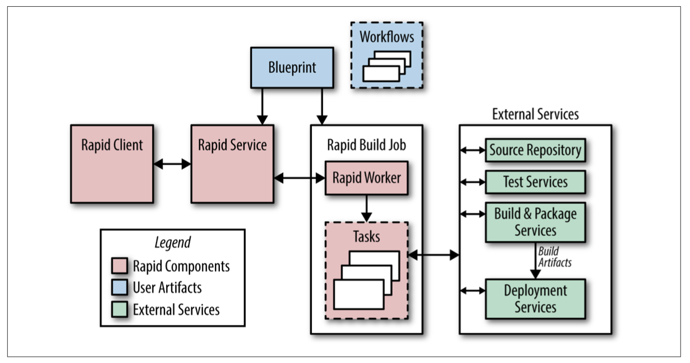

## Release Engineering

Release engineering is a relatively new and fast-growing discipline of software engi‐ neering that can be concisely described as building and delivering software. Release engineers have a solid (if not expert) understanding of source code management, compilers, build configuration languages, automated build tools, package managers, and installers. Their skill set includes deep knowledge of multiple domains: development, configuration management, test integration, system adminis‐ tration, and customer support.

Running reliable services requires reliable release processes. Site Reliability Engineers (SREs) need to know that the binaries and configurations they use are built in a reproducible, automated way so that releases are repeatable and aren’t “unique snow‐ flakes.” Changes to any aspect of the release process should be intentional, rather than accidental. SREs care about this process from source code to deployment.

### The Role of a Release Engineer

Release engineers define best practices for using our tools in order to make sure projects are released using consistent and repeatable methodologies. Our best practi‐ ces cover all elements of the release process. Examples include compiler flags, formats for build identification tags, and required steps during a build. Making sure that our tools behave correctly by default and are adequately documented makes it easy for teams to stay focused on features and users, rather than spending time reinventing the wheel (poorly) when it comes to releasing software.

### Philosophy

#### Self-Service Model

Release processes can be automated to the point that they require minimal involvement by the engineers, and many projects are automatically built and released using a combination of our automated build system and our deployment tools. Releases are truly automatic, and only require engineer involvement if and when problems arise.

#### High Velocity

Selection is based upon the test results and the features con‐ tained in a given build. Other teams have adopted a “Push on Green” release model and deploy every build that passes all tests.

#### Hermetic Builds

Rebuilding older releases when we need to fix a bug in software that’s running in pro‐ duction can be a challenge. We accomplish this task by rebuilding at the same revi‐ sion as the original build and including specific changes that were submitted after that point in time. We call this tactic cherry picking. Our build tools are themselves versioned based on the revision in the source code repository for the project being built. Therefore, a project built last month won’t use this month’s version of the com‐ piler if a cherry pick is required, because that version may contain incompatible or undesired features.

#### Enforcement of Policies and Procedures

Several layers of security and access control determine who can perform specific operations when releasing a project. Gated operations include:
- Approving source code changes—this operation is managed through configura‐ tion files scattered throughout the codebase
- Specifying the actions to be performed during the release process
- Creating a new release
- Approving the initial integration proposal (which is a request to perform a build at a specific revision number in the source code repository) and subsequent cherry picks
- Deploying a new release
- Making changes to a project’s build configuration

### Continuous Build and Deployment

#### Building

Build targets for binaries and unit tests are defined in Rapid’s project configuration files. Project-specific flags, such as a unique build identifier, are passed by Rapid to Blaze. All binaries support a flag that displays the build date, the revision number, and the build identifier, which allow us to easily associate a binary to a record of how it was built.

#### Branching

All code is checked into the main branch of the source code tree (mainline). How‐ ever, most major projects don’t release directly from the mainline. Instead, we branch from the mainline at a specific revision and never merge changes from the branch back into the mainline. Bug fixes are submitted to the mainline and then cherry picked into the branch for inclusion in the release. This practice avoids inadvertently picking up unrelated changes submitted to the mainline since the original build occurred. Using this branch and cherry pick method, we know the exact contents of each release.

#### Testing

A continuous test system runs unit tests against the code in the mainline each time a change is submitted, allowing us to detect build and test failures quickly. Release engineering recommends that the continuous build test targets correspond to the same test targets that gate the project release. We also recommend creating releases at the revision number (version) of the last continuous test build that successfully com‐ pleted all tests. These measures decrease the chance that subsequent changes made to the mainline will cause failures during the build performed at release time.

#### Packaging

Labels can be applied to an MPM package to indicate a package’s location in the release process (e.g., dev, canary, or production). If you apply an existing label to a new package, the label is automatically moved from the old package to the new pack‐ age. For example: if a package is labeled as canary, someone subsequently installing the canary version of that package will automatically receive the newest version of the package with the label canary.

#### Rapid

A typical release process proceeds as follows:

1. Rapid uses the requested integration revision number (often obtained automati‐ cally from our continuous test system) to create a release branch.
2. Rapid uses Blaze to compile all the binaries and execute the unit tests, often per‐ forming these two steps in parallel. Compilation and testing occur in environ‐ ments dedicated to those specific tasks, as opposed to taking place in the Borg job where the Rapid workflow is executing. This separation allows us to parallelize work easily.
3. Build artifacts are then available for system testing and canary deployments. A typical canary deployment involves starting a few jobs in our production envi‐ ronment after the completion of system tests.
4. The results of each step of the process are logged. A report of all changes since the last release is created.

#### Deployment

Our goal is to fit the deployment process to the risk profile of a given service. In development or pre-production environments, we may build hourly and push relea‐ ses automatically when all tests pass. For large user-facing services, we may push by starting in one cluster and expand exponentially until all clusters are updated. For sensitive pieces of infrastructure, we may extend the rollout over several days, inter‐ leaving them across instances in different geographic regions.

### Configuration Management

Use the mainline for configuration. This was the first method used to configure serv‐ ices in Borg (and the systems that pre-dated Borg). Using this scheme, developers and SREs modify configuration files at the head of the main branch. The changes are reviewed and then applied to the running system. As a result, binary releases and configuration changes are decoupled. While conceptually and procedurally simple, this technique often leads to skew between the checked-in version of the configura‐ tion files and the running version of the configuration file because jobs must be upda‐ ted in order to pick up the changes.

Include configuration files and binaries in the same MPM package. For projects with few configuration files or projects where the files (or a subset of files) change with each release cycle, the configuration files can be included in the MPM package with the binaries. While this strategy limits flexibility by binding the binary and configura‐ tion files tightly, it simplifies deployment, because it only requires installing one package.

Package configuration files into MPM “configuration packages.” We can apply the her‐ metic principle to configuration management. Binary configurations tend to be tightly bound to particular versions of binaries, so we leverage the build and packag‐ ing systems to snapshot and release configuration files alongside their binaries. Simi‐ lar to our treatment of binaries, we can use the build ID to reconstruct the configuration at a specific point in time.

Read configuration files from an external store. Some projects have configuration files that need to change frequently or dynamically (i.e., while the binary is running). These files can be stored in Chubby, Bigtable, or our source-based filesystem.

### Conclusions

#### It’s Not Just for Googlers

When equipped with the right tools, proper automation, and well-defined policies, developers and SREs shouldn’t have to worry about releasing software. Releases can be as painless as simply pressing a button.

#### Start Release Engineering at the Beginning

Teams should budget for release engineering resources at the beginning of the prod‐ uct development cycle. It’s cheaper to put good practices and process in place early, rather than have to retrofit your system later.

It is essential that the developers, SREs, and release engineers work together. The release engineer needs to understand the intention of how the code should be built and deployed. The developers shouldn’t build and “throw the results over the fence” to be handled by the release engineers.

