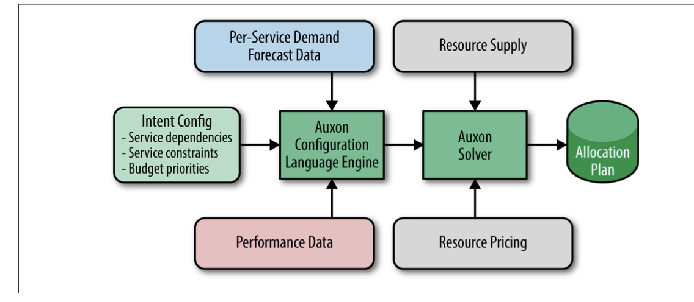

## Software Engineering in SRE

### Why Is Software Engineering Within SRE Important?

SREs are in a unique position to effectively develop internal software for a number of reasons:
- The breadth and depth of Google-specific production knowledge within the SRE organization allows its engineers to design and create software with the appropri‐ ate considerations for dimensions such as scalability, graceful degradation during failure, and the ability to easily interface with other infrastructure or tools.
- Because SREs are embedded in the subject matter, they easily understand the needs and requirements of the tool being developed.
- A direct relationship with the intended user—fellow SREs—results in frank and high-signal user feedback. Releasing a tool to an internal audience with high familiarity with the problem space means that a development team can launch and iterate more quickly. Internal users are typically more understanding when it comes to minimal UI and other alpha product issues.

From a purely pragmatic standpoint, Google clearly benefits from having engineers with SRE experience developing software. By deliberate design, the growth rate of SRE-supported services exceeds the growth rate of the SRE organization; one of SRE’s guiding principles is that “team size should not scale directly with service growth.” Achieving linear team growth in the face of exponential service growth requires per‐ petual automation work and efforts to streamline tools, processes, and other aspects of a service that introduce inefficiency into the day-to-day operation of production. Having the people with direct experience running production systems developing the tools that will ultimately contribute to uptime and latency goals makes a lot of sense.

On the flip side, individual SREs, as well as the broader SRE organization, also benefit from SRE-driven software development.

Fully fledged software development projects within SRE provide career development opportunities for SREs, as well as an outlet for engineers who don’t want their coding skills to get rusty. Long-term project work provides much-needed balance to inter‐ rupts and on-call work, and can provide job satisfaction for engineers who want their careers to maintain a balance between software engineering and systems engineering.

Beyond the design of automation tools and other efforts to reduce the workload for engineers in SRE, software development projects can further benefit the SRE organi‐ zation by attracting and helping to retain engineers with a broad variety of skills. The desirability of team diversity is doubly true for SRE, where a variety of backgrounds and problem-solving approaches can help prevent blind spots. To this end, Google always strives to staff its SRE teams with a mix of engineers with traditional software development experience and engineers with systems engineering experience.

### Auxon Case Study: Project Background and Problem Space

#### Traditional Capacity Planning

1) Collect demand forecasts.
2) Devise build and allocation plans.
3) Review and sign off on plan.
4) Deploy and configure resources.

_Brittle by nature_

Traditional capacity planning produces a resource allocation plan that can be disrup‐ ted by any seemingly minor change. For example:
- A service undergoes a decrease in efficiency, and needs more resources than expected to serve the same demand.
- Customer adoption rates increase, resulting in an increase in projected demand.
- The delivery date for a new cluster of compute resources slips.
- A product decision about a performance goal changes the shape of the required service deployment (the service’s footprint) and the amount of required resources.

_Laborious and imprecise_

For many teams, the process of collecting the data necessary to generate demand forecasts is slow and error-prone. And when it is time to find capacity to meet this future demand, not all resources are equally suitable. For example, if latency require‐ ments mean that a service must commit to serve user demand on the same continent as the user, obtaining additional resources in North America won’t alleviate a capacity shortfall in Asia. Every forecast has constraints, or parameters around how it can be fulfilled; constraints are fundamentally related to intent, which is discussed in the next section.

Mapping constrained resource requests into allocations of actual resources from the available capacity is equally slow: it’s both complex and tedious to bin pack requests into limited space by hand, or to find solutions that fit a limited budget.

### Our Solution: Intent-Based Capacity Planning

The basic premise of this approach is to programmatically encode the dependencies and parameters (intent) of a service’s needs, and use that encoding to autogenerate an allocation plan that details which resources go to which service, in which cluster. If demand, supply, or service requirements change, we can simply autogenerate a new plan in response to the changed parameters, which is now the new best distribution of resources.

### Intent-Based Capacity Planning

Intent is the rationale for how a service owner wants to run their service. 

#### Precursors to Intent

What information do we need in order to capture a service’s intent? Enter dependencies, performance metrics, and prioritization.

_Dependencies_

Services at Google depend on many other infrastructure and user-facing services, and these dependencies heavily influence where a service can be placed.

_Performance metrics_

Demand for one service trickles down to result in demand for one or more other services. Understanding the chain of dependencies helps formulate the general scope of the bin packing problem, but we still need more information about expected resource usage. 

_Prioritization_

Inevitably, resource constraints result in trade-offs and hard decisions: of the many requirements that all services have, which requirements should be sacrificed in the face of insufficient capacity?

### Introduction to Auxon

Auxon is Google’s implementation of an intent-based capacity planning and resource allocation solution, and a prime example of an SRE-designed and developed software engineering product: it was built by a small group of software engineers and a techni‐ cal program manager within SRE over the course of two years. Auxon is a perfect case study to demonstrate how software development can be fostered within SRE.

Auxon provides the means to collect intent-based descriptions of a service’s resource requirements and dependencies. These user intents are expressed as requirements for how the owner would like the service to be provisioned. Require‐ ments might be specified as a request like, “My service must be N + 2 per continent” or “The frontend servers must be no more than 50 ms away from the backend servers.” Auxon collects this information either via a user configuration language or via a programmatic API, thus translating human intent into machine-parseable con‐ straints. Requirements can be prioritized, a feature that’s useful if resources are insuf‐ ficient to meet all requirements, and therefore trade-offs must be made. These requirements—the intent—are ultimately represented internally as a giant mixed- integer or linear program. Auxon solves the linear program, and uses the resultant bin packing solution to formulate an allocation plan for resources.

Resource Supply provides data about the availability of base-level, fundamental resources: for example, the number of machines expected to be available for use at a particular point in the future. In linear program terminology, the resource supply acts as an upper bound that limits how services can grow and where services can be placed. Ultimately, we want to make the best use of this resource supply as the intent- based description of the combined group of services allows.

Resource Pricing provides data about how much base-level, fundamental resources cost. For instance, the cost of machines may vary globally based upon the space/ power charges of a given facility. In linear program terminology, the prices inform the overall calculated costs, which act as the objective that we want to minimize.

Intent Config is the key to how intent-based information is fed to Auxon. It defines what constitutes a service, and how services relate to one another. The config ulti‐ mately acts as a configuration layer that allows all the other components to be wired together. It’s designed to be human-readable and configurable.

Auxon Configuration Language Engine acts based upon the information it receives from the Intent Config. This component formulates a machine-readable request (a protocol buffer that can be understood by the Auxon Solver. It applies light sanity checking to the configuration, and is designed to act as the gateway between the human-configurable intent definition and the machine-parseable optimization request.

Auxon Solver is the brain of the tool. It formulates the giant mixed-integer or linear program based upon the optimization request received from the Configuration Lan‐ guage Engine. It is designed to be very scalable, which allows the solver to run in par‐ allel upon hundreds or even thousands of machines running within Google’s clusters. In addition to mixed-integer linear programming toolkits, there are also components within the Auxon Solver that handle tasks such as scheduling, managing a pool of workers, and descending decision trees.

Allocation Plan is the output of the Auxon Solver. It prescribes which resources should be allocated to which services in what locations. It is the computed implemen‐ tation details of the intent-based definition of the capacity planning problem’s requirements. The Allocation Plan also includes information about any requirements that could not be satisfied—for example, if a requirement couldn’t be met due to a lack of resources, or competing requirements that were otherwise too strict.

### Requirements and Implementation: Successes and Lessons Learned

**Approximation**

Don’t focus on perfection and purity of solution, especially if the bounds of the prob‐ lem aren’t well known. Launch and iterate.

If there’s one theme to draw from our Auxon case study, it’s that the old motto of “launch and iterate” is particularly relevant in SRE software development projects. Don’t wait for the perfect design; rather, keep the overall vision in mind while moving ahead with design and development. When you encounter areas of uncertainty, design the software to be flexible enough so that if process or strategy changes at a higher level, you don’t incur a huge rework cost. But at the same time, stay grounded by making sure that general solutions have a real-world–specific implementation that demonstrates the utility of the design.

### Raising Awareness and Driving Adoption

As with any product, SRE-developed software must be designed with knowledge of its users and requirements. It needs to drive adoption through utility, performance, and demonstrated ability to both benefit Google’s production reliability goals and to bet‐ ter the lives of SREs. The process of socializing a product and achieving buy-in across an organization is key to the project’s success.

Don’t underestimate the effort required to raise awareness and interest in your soft‐ ware product—a single presentation or email announcement isn’t enough. Socializing internal software tools to a large audience demands all of the following:
- A consistent and coherent approach
- User advocacy
- The sponsorship of senior engineers and management, to whom you will have to demonstrate the utility of your product

**Set expectations**

When an engineer with years of familiarity in a problem space begins designing a product, it’s easy to imagine a utopian end-state for the work. However, it’s important to differentiate aspirational goals of the product from minimum success criteria (or Minimum Viable Product). Projects can lose credibility and fail by promising too much, too soon; at the same time, if a product doesn’t promise a sufficiently reward‐ ing outcome, it can be difficult to overcome the necessary activation energy to con‐ vince internal teams to try something new. Demonstrating steady, incremental progress via small releases raises user confidence in your team’s ability to deliver use‐ ful software.

**Identify appropriate customers**

The team developing Auxon realized that a one-size solution might not fit all; many larger teams already had home-grown solutions for capacity planning that worked passably well. While their custom tools weren’t perfect, these teams didn’t experience sufficient pain in the capacity planning process to try a new tool, especially an alpha release with rough edges.

**Customer service**

Even though software developed within SRE targets an audience of TPMs and engi‐ neers with high technical proficiency, any sufficiently innovative software still presents a learning curve to new users. Don’t be afraid to provide white glove cus‐ tomer support for early adopters to help them through the onboarding process. Sometimes automation also entails a host of emotional concerns, such as fear that someone’s job will be replaced by a shell script. By working one-on-one with early users, you can address those fears personally, and demonstrate that rather than own‐ ing the toil of performing a tedious task manually, the team instead owns the configu‐ rations, processes, and ultimate results of their technical work. Later adopters are convinced by the happy examples of early adopters.

**Designing at the right level**

An idea that we’ve termed agnosticism—writing the software to be generalized to allow myriad data sources as input—was a key principle of Auxon’s design. Agnosti‐ cism meant that customers weren’t required to commit to any one tool in order to use the Auxon framework. This approach allowed Auxon to remain of sufficient general utility even as teams with divergent use cases began to use it. We approached poten‐ tial users with the message, “come as you are; we’ll work with what you’ve got.” By avoiding over-customizing for one or two big users, we achieved broader adoption across the organization and lowered the barrier to entry for new services.

#### Team Dynamics

In selecting engineers to work on an SRE software development product, we’ve found great benefit from creating a seed team that combines generalists who are able to get up to speed quickly on a new topic with engineers possessing a breadth of knowledge and experience. A diversity of experiences covers blind spots as well as the pitfalls of assuming that every team’s use case is the same as yours.

### Fostering Software Engineering in SRE

It’s important for the project to fit into the overall set of objectives for the organiza‐ tion, so that engineering leaders can weigh its potential impact and subsequently advocate for your project, both with their reporting teams and with other teams that might interface with their teams. Cross-organizational socialization and review help
prevent disjoint or overlapping efforts, and a product that can easily be established as furthering a department-wide objective is easier to staff and support.

#### Successfully Building a Software Engineering Culture in SRE: Staffing and Development Time

SREs are often generalists, as the desire to learn breadth-first instead of depth-first lends itself well to understanding the bigger picture (and there are few pictures bigger than the intricate inner workings of modern technical infrastructure). These engi‐ neers often have strong coding and software development skills, but may not have the traditional SWE experience of being part of a product team or having to think about customer feature requests. A quote from an engineer on an early SRE software devel‐ opment project sums up the conventional SRE approach to software: “I have a design doc; why do we need requirements?” Partnering with engineers, TPMs, or PMs who are familiar with user-facing software development can help build a team software development culture that brings together the best of both software product develop‐ ment and hands-on production experience.

Dedicated, noninterrupted, project work time is essential to any software develop‐ ment effort. Dedicated project time is necessary to enable progress on a project, because it’s nearly impossible to write code—much less to concentrate on larger, more impactful projects—when you’re thrashing between several tasks in the course of an hour. Therefore, the ability to work on a software project without interrupts is often an attractive reason for engineers to begin working on a development project. Such time must be aggressively defended.

The majority of software products developed within SRE begin as side projects whose utility leads them to grow and become formalized. At this point, a product may branch off into one of several possible directions:

- Remain a grassroots effort developed in engineers’ spare time
- Become established as a formal project through structured processes (see “Get‐
ting There”)
- Gain executive sponsorship from within SRE leadership to expand into a fully
staffed software development effort

However, in any of these scenarios—and this is a point worth stressing—it’s essential that the SREs involved in any development effort continue working as SREs instead of becoming full-time developers embedded in the SRE organization. Immersion in the world of production gives SREs performing development work an invaluable per‐ spective, as they are both the creator and the customer for any product.

#### Getting There

First, recognize that this goal is as much an organizational change as it is a technical challenge. SREs are used to working closely with their teammates, quickly analyzing and reacting to problems. Therefore, you’re working against the natural instinct of an SRE to quickly write some code to meet their immediate needs. If your SRE team is small, this approach may not be problematic. However, as your organization grows, this ad hoc approach won’t scale, instead resulting in largely functional, yet narrow or single-purpose, software solutions that can’t be shared, which inevitably lead to dupli‐ cated efforts and wasted time.

Next, think about what you want to achieve by developing software in SRE. Do you just want to foster better software development practices within your team, or are you interested in software development that produces results that can be used across teams, possibly as a standard for the organization? In larger established organiza‐ tions, the latter change will take time, possibly spanning multiple years. Such a change needs to be tackled on multiple fronts, but has a higher payback. The follow‐ ing are some guidelines from Google’s experience:

- Create and communicate a clear message
- Evaluate your organization’s capabilities
- Launch and iterate
- Don’t lower your standards

#### Conclusions

SRE-driven software projects are also noticeably beneficial to the company in developing a sustainable model for supporting services at scale. Because SREs often develop software to streamline inefficient processes or automate common tasks, these projects mean that the SRE team doesn’t have to scale linearly with the size of the services they support. Ultimately, the benefits of having SREs devoting some of their time to software devel‐ opment are reaped by the company, the SRE organization, and the SREs themselves.

