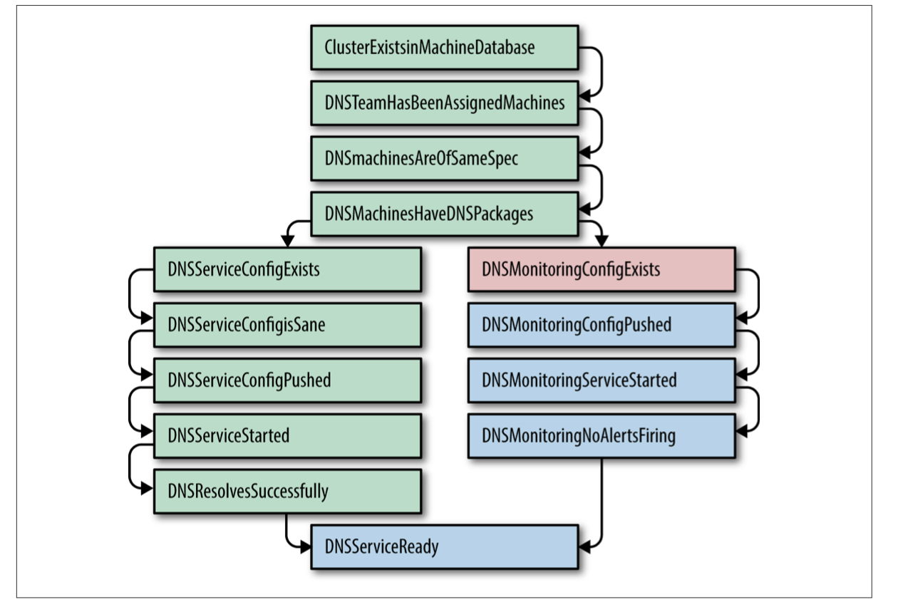
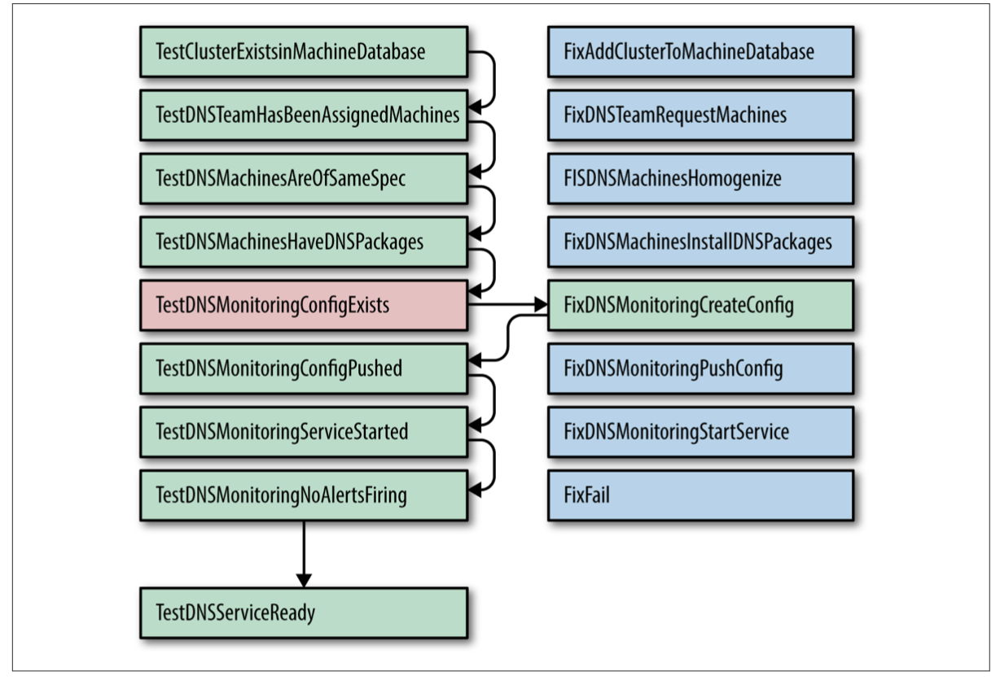

## The Evolution of Automation at Google

For SRE, automation is a force multiplier, not a panacea. Of course, just multiplying force does not naturally change the accuracy of where that force is applied: doing automation thoughtlessly can create as many problems as it solves. 

### The Value of Automation

#### Consistency

For a start, any action performed by a human or humans hundreds of times won’t be performed the same way each time: even with the best will in the world, very few of us will ever be as consistent as a machine.

#### A Platform

Automation doesn’t just provide consistency. Designed and done properly, automatic systems also provide a platform that can be extended, applied to more systems, or perhaps even spun out for profit.

#### Faster Repairs

There’s an additional benefit for systems where automation is used to resolve com‐ mon faults in a system (a frequent situation for SRE-created automation). If automa‐ tion runs regularly and successfully enough, the result is a reduced mean time to repair (MTTR) for those common faults. 

#### Faster Action

In the infrastructural situations where SRE automation tends to be deployed, humans don’t usually react as fast as machines. 

#### Time Saving

Therefore, the time savings apply across anyone who would plausibly use the automation. Decoupling operator from operation is very powerful.

### The Value for Google SRE

For truly large services, the factors of consistency, quickness, and reliability dominate most conversations about the trade-offs of performing automation.

### The Use Cases for Automation

As we implied earlier, there are a number of use cases for automation. Here is a non- exhaustive list of examples:
- User account creation
- Cluster turnup and turndown for services
- Software or hardware installation preparation and decommissioning
- Rollouts of new software versions
- Runtime configuration changes
- A special case of runtime config changes: changes to your dependencies

#### Google SRE’s Use Cases for Automation

The context for our automation is often automation to manage the lifecycle of systems, not their data: for example, deployments of a service in a new cluster.

#### A Hierarchy of Automation Classes

The evolution of automation follows a path:

1. No automation:
Database master is failed over manually between locations.
2. Externally maintained system-specific automation:
An SRE has a failover script in his or her home directory.
3. Externally maintained generic automation:
The SRE adds database support to a “generic failover” script that everyone uses.
4. Internally maintained system-specific automation:
The database ships with its own failover script.
5. Systems that don’t need any automation:
The database notices problems, and automatically fails over without human intervention.

#### Automate Yourself Out of a Job: Automate ALL the Things!

We hoped this migration would provide two main benefits:
- Completely eliminate machine/replica maintenance: Borg would automatically handle the setup/restart of new and broken tasks.
- Enable bin-packing of multiple MySQL instances on the same physical machine: Borg would enable more efficient use of machine resources via Containers.

This example demonstrates the wisdom of going the extra mile to deliver a platform rather than replacing existing manual procedures. The next example comes from the cluster infrastructure group, and illustrates some of the more difficult trade-offs you might encounter on your way to automating all the things.

#### Soothing the Pain: Applying Automation to Cluster Turnups
     
The steps taken to get a cluster ready for use were something like the following:
1. Fit out a datacenter building for power and cooling.
2. Install and configure core switches and connections to the backbone.
3. Install a few initial racks of servers.
4. Configure basic services such as DNS and installers, then configure a lock ser‐ vice, storage, and computing.
5. Deploy the remaining racks of machines.
6. Assign user-facing services resources, so their teams can set up the services.

#### Detecting Inconsistencies with Prodtest

The creative—though brittle—shell scripts we used to configure clusters were neither scaling to the number of people who wanted to make changes nor to the sheer num‐ ber of cluster permutations that needed to be built. These shell scripts also failed to resolve more significant concerns before declaring that a service was good to take customer-facing traffic, such as:
- Were all of the service’s dependencies available and correctly configured?
- Were all configurations and packages consistent with other deployments?
- Could the team confirm that every configuration exception was desired?

ProdTest for DNS Service, showing how one failed test aborts the subsequent chain of tests

#### Resolving Inconsistencies Idempotently

The unit test already knew which cluster we were examining and the specific test that was failing, so we paired each test with a fix. If each fix was written to be idempotent, and could assume that all dependencies were met, resolving the problem should have been easy—and safe—to resolve. Requiring idempotent fixes meant teams could run their “fix script” every 15 minutes without fearing damage to the cluster’s configura‐ tion. If the DNS team’s test was blocked on the Machine Database team’s configura‐ tion of a new cluster, as soon as the cluster appeared in the database, the DNS team’s tests and fixes would start working.

Looking back, this approach was deeply flawed; the latency between the test, the fix, and then a second test introduced flaky tests that sometimes worked and sometimes failed. Not all fixes were naturally idempotent, so a flaky test that was followed by a fix might render the system in an inconsistent state.

#### The Inclination to Specialize

Automation processes can vary in three respects:
- Competence, i.e., their accuracy
- Latency, how quickly all steps are executed when initiated
- Relevance, or proportion of real-world process covered by automation

We began with a process that was highly competent (maintained and run by the ser‐ vice owners), high-latency (the service owners performed the process in their spare time or assigned it to new engineers), and very relevant (the service owners knew when the real world changed, and could fix the automation).

Automation code, like unit test code, dies when the maintaining team isn’t obsessive about keeping the code in sync with the codebase it covers. The world changes around the code: the DNS team adds new configuration options, the storage team changes their package names, and the networking team needs to support new devices.

By relieving teams who ran services of the responsibility to maintain and run their automation code, we created ugly organizational incentives:
- A team whose primary task is to speed up the current turnup has no incentive to reduce the technical debt of the service-owning team running the service in pro‐ duction later.
- A team not running automation has no incentive to build systems that are easy to automate.
- A product manager whose schedule is not affected by low-quality automation will always prioritize new features over simplicity and automation.

Turnups were again high-latency, inaccurate, and incompetent—the worst of all worlds. However, an unrelated security mandate allowed us out of this trap. Much of distributed automation relied at that time on SSH. This is clumsy from a security per‐ spective, because people must have root on many machines to run most commands. A growing awareness of advanced, persistent security threats drove us to reduce the privileges SREs enjoyed to the absolute minimum they needed to do their jobs. We had to replace our use of sshd with an authenticated, ACL-driven, RPC-based Local Admin Daemon, also known as Admin Servers, which had permissions to perform those local changes. As a result, no one could install or modify a server without an audit trail. Changes to the Local Admin Daemon and the Package Repo were gated on code reviews, making it very difficult for someone to exceed their authority; giving someone the access to install packages would not let them view colocated logs. The Admin Server logged the RPC requestor, any parameters, and the results of all RPCs to enhance debugging and security audits.

#### Service-Oriented Cluster-Turnup

Later on, after the realization that turnup processes had to be owned by the teams that owned the services fully sank in, we saw this as a way to approach cluster turnup as a Service-Oriented Architecture (SOA) problem: service owners would be respon‐ sible for creating an Admin Server to handle cluster turnup/turndown RPCs, sent by the system that knew when clusters were ready. In turn, each team would provide the contract (API) that the turnup automation needed, while still being free to change the underlying implementation. As a cluster reached “network-ready,” automation sent an RPC to each Admin Server that played a part in turning up the cluster.

As mentioned earlier, our evolution of turnup automation followed a path:
1. Operator-triggered manual action (no automation)
2. Operator-written, system-specific automation
3. Externally maintained generic automation
4. Internally maintained, system-specific automation
5. Autonomous systems that need no human intervention

### Borg: Birth of the Warehouse-Scale Computer

Automation development began. Initially automation consisted of simple Python scripts for operations such as the following:
- Service management: keeping services running (e.g., restarts after segfaults)
- Tracking what services were supposed to run on which machines
- Log message parsing: SSHing into each machine and looking for regexps

To echo the words of Ben Treynor Sloss: by taking the approach that this was a software problem, the initial automation bought us enough time to turn cluster management into something autonomous, as opposed to automated. We achieved this goal by bringing ideas related to data distribution, APIs, hub-and-spoke architectures, and classic distributed system software development to bear upon the domain of infrastructure management.
 
 
### Reliability Is the Fundamental Feature
 
Human operators are progressively more relieved of useful direct contact with the system as the automation covers more and more daily activities over time. Inevitably, then, a situation arises in which the automation fails, and the humans are now unable to successfully operate the system.

Reliability is the fundamental feature, and autonomous, resilient behavior is one useful way to get that.

### Recommendations

You might read the examples in this chapter and decide that you need to be Google- scale before you have anything to do with automation whatsoever. This is untrue, for two reasons: automation provides more than just time saving, so it’s worth imple‐ menting in more cases than a simple time-expended versus time-saved calculation might suggest. But the approach with the highest leverage actually occurs in the design phase: shipping and iterating rapidly might allow you to implement function‐ ality faster, yet rarely makes for a resilient system. Autonomous operation is difficult to convincingly retrofit to sufficiently large systems, but standard good practices in software engineering will help considerably: having decoupled subsystems, introduc‐ ing APIs, minimizing side effects, and so on.

