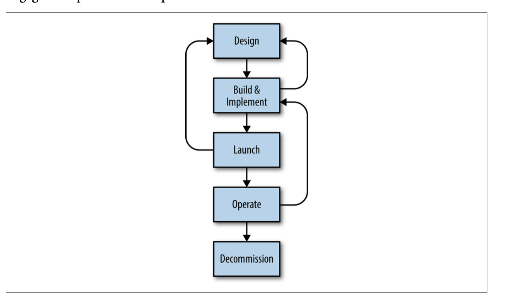

## The Evolving SRE Engagement Model

### SRE Engagement: What, How, and Why

In the first case, just as in software engineering—where the earlier the bug is found, the cheaper it is to fix—the earlier an SRE team consultation happens, the better the service will be and the quicker it will feel the benefit. When SRE is engaged during the earliest stages of design, the time to onboard is lowered and the service is more reliable “out of the gate,” usually because we don’t have to spend the time unwinding suboptimal design or implementation.

### The PRR Model

The most typical initial step of SRE engagement is the Production Readiness Review (PRR), a process that identifies the reliability needs of a service based on its specific details. Through a PRR, SREs seek to apply what they’ve learned and experienced to ensure the reliability of a service operating in production. A PRR is considered a pre‐ requisite for an SRE team to accept responsibility for managing the production aspects of a service.

Figure illustrates the lifecycle of a typical service. The Production Readiness Review can be started at any point of the service lifecycle, but the stages at which SRE engagement is applied have expanded over time. This chapter describes the Simple PRR Model, then discusses how its modification into the Extended Engagement Model and the Frameworks and SRE Platform structure allowed SRE to scale their engagement process and impact.

#### The SRE Engagement Model

These aspects include the following:
- System architecture and interservice dependencies
- Instrumentation, metrics, and monitoring
- Emergency response
- Capacity planning
- Change management
- Performance: availability, latency, and efficiency

#### Alternative Support

Not all Google services receive close SRE engagement. 

When SRE can’t provide full-fledged support, it provides other options for making improvements to production, such as documentation and consultation.

- Development guides are available for internal technologies and clients of widely used systems. Google’s Production Guide documents production best practices for serv‐ ices, as determined by the experiences of SRE and development teams alike. Develop‐ ers can implement the solutions and recommendations in such documentation to improve their services.
- Consultation sessions are necessarily broad in scope because it’s not possible to gain a deep understanding of a given system in the limited time available. For some devel‐ opment teams, consultation is not sufficient Services that have grown by orders of magnitude since they launched, which now require more time to understand than is feasible through documentation and consultation. Services upon which many other services have subsequently come to rely upon, which now host significantly more traffic from many different clients.

#### Production Readiness Reviews: Simple PRR Model

The objectives of the Production Readiness Review are as follows:
- Verify that a service meets accepted standards of production setup and opera‐ tional readiness, and that service owners are prepared to work with SRE and take advantage of SRE expertise.
- Improve the reliability of the service in production, and minimize the number and severity of incidents that might be expected. A PRR targets all aspects of pro‐ duction that SRE cares about.

#### Engagement

SRE leadership first decides which SRE team is a good fit for taking over the service. Usually one to three SREs are selected or self-nominated to conduct the PRR process. This small group then initiates discussion with the development team. The discussion covers matters such as:
- Establishing an SLO/SLA for the service
- Planning for potentially disruptive design changes required to improve reliability
- Planning and training schedules

#### Analysis

A few examples of checklist items include:
- Do updates to the service impact an unreasonably large percentage of the system at once?
- Does the service connect to the appropriate serving instance of its dependencies? For example, end-user requests to a service should not depend on a system that is designed for a batch-processing use case.
- Does the service request a sufficiently high network quality-of-service when talk‐ ing to a critical remote service?
- Does the service report errors to central logging systems for analysis? Does it report all exceptional conditions that result in degraded responses or failures to the end users?
- Are all user-visible request failures well instrumented and monitored, with suit‐ able alerting configured?

#### Improvements and Refactoring

The Analysis phase leads to the identification of recommended improvements for the service. This next phase proceeds as follows:
1. Improvements are prioritized based upon importance for service reliability.
2. The priorities are discussed and negotiated with the development team, and a plan of execution is agreed upon.
3. Both SRE and product development teams participate and assist each other in refactoring parts of the service or implementing additional features.

#### Training
- Design overviews
- Deep dives on various request flows in the system
- A description of the production setup
- Hands-on exercises for various aspects of system operations

#### Onboarding

The Training phase unblocks onboarding of the service by the SRE team. It involves a progressive transfer of responsibilities and ownership of various production aspects of the service, including parts of operations, the change management process, access rights, and so forth. The SRE team continues to focus on the various areas of produc‐ tion mentioned earlier. To complete the transition, the development team must be available to back up and advise the SRE team for a period of time as it settles in man‐ aging production for the service. This relationship becomes the basis for the ongoing work between the teams.

#### Continuous Improvement

Active services continuously change in response to new demands and conditions, including user requests for new features, evolving system dependencies, and technol‐ ogy upgrades, in addition to other factors. 

### Evolving the Simple PRR Model: Early Engagement

#### Candidates for Early Engagement

Applicable services often have the follow‐ ing characteristics:
- The service implements significant new functionality and will be part of an exist‐ ing system already managed by SRE.
- The service is a significant rewrite or alternative to an existing system, targeting the same use cases.
- The development team sought SRE advice or approached SRE for takeover upon launch.

#### Benefits of the Early Engagement Model

- Design phase:SRE collaboration during the Design phase can prevent a variety of problems or inci‐ dents from occurring later in production. While design decisions can be reversed or rectified later in the development lifecycle, such changes come at a high cost in terms of effort and complexity. The best production incidents are those that never happen!
- Build and implementation: The Build phase addresses production aspects such as instrumentation and metrics, operational and emergency controls, resource usage, and efficiency. During this phase, SRE can influence and improve the implementation by recommending specific existing libraries and components, or helping build certain controls into the system. SRE participation at this stage helps enable ease of operations in the future and allows SRE to gain operational experience in advance of the launch.
- Launch: SRE can also help implement widely used launch patterns and controls. For example, SRE might help implement a “dark launch” setup, in which part of the traffic from existing users is sent to the new service in addition to being sent to the live produc‐ tion service. The responses from the new service are “dark” since they are thrown away and not actually shown to users. 
- Post-launch: Having a stable system at launch time generally leads to fewer conflicting priorities for the development team in terms of choosing between improving service reliability versus adding new features. In later phases of the service, the lessons from earlier phases can better inform refactoring or redesign.
- Disengaging from a service: Sometimes a service doesn’t warrant full-fledged SRE team management—this deter‐ mination might be made post-launch, or SRE might engage with a service but never officially take it over. This is a positive outcome, because the service has been engi‐ neered to be reliable and low maintenance, and can therefore remain with the devel‐ opment team.

### Evolving Services Development: Frameworks and SREPlatform

- Additional communication between teams can increase some process overhead for the development team, and cognitive burden for the SRE reviewers.
- The right SRE reviewers must be available, and capable of managing their time and priorities with regards to their existing engagements.
- Work done by SREs must be highly visible and sufficiently reviewed by the devel‐ opment team to ensure effective knowledge sharing. SREs should essentially work as a part of the development team, rather than an external unit.

#### Candidates for Early Engagement

Applicable services often have the follow‐ ing characteristics:
- The service implements significant new functionality and will be part of an exist‐ ing system already managed by SRE.
- The service is a significant rewrite or alternative to an existing system, targeting the same use cases.
- The development team sought SRE advice or approached SRE for takeover upon launch.

### Evolving Services Development: Frameworks and SRE Platform
     
Lessons Learned:
Over time, the SRE engagement model described thus far produced several distinct patterns:
- Onboarding each service required two or three SREs and typically lasted two or three quarters. The lead times for a PRR were relatively high (quarters away). The effort level required was proportional to the number of services under review, and was constrained by the insufficient number of SREs available to conduct PRRs. These conditions led to serialization of service takeovers and strict service prioritization.
- Due to differing software practices across services, each production feature was implemented differently. To meet PRR-driven standards, features usually had to be reimplemented specifically for each service or, at best, once for each small sub‐ set of services sharing code. These reimplementations were a waste of engineer‐ ing effort. One canonical example is the implementation of functionally similar logging frameworks repeatedly in the same language because different services didn’t implement the same coding structure.
- A review of common service issues and outages revealed certain patterns, but there was no way to easily replicate fixes and improvements across services. Typi‐ cal examples included service overload situations and data hot-spotting.
- SRE software engineering contributions were often local to the service. Thus, building generic solutions to be reused was difficult. As a consequence, there was no easy way to implement new lessons individual SRE teams learned and best practices across services that had already been onboarded.

#### External Factors Affecting SRE

Google is increasingly following the industry trend of moving toward microservices.1

As a result, both the number of requests for SRE support and the cardinality of serv‐ ices to support have increased. Because each service has a base fixed operational cost, even simple services demand more staffing. Microservices also imply an expectation of lower lead time for deployment, which was not possible with the previous PRR model (which had a lead time of months).

Hiring experienced, qualified SREs is difficult and costly. Despite enormous effort from the recruiting organization, there are never enough SREs to support all the serv‐ ices that need their expertise. Once SREs are hired, their training is also a lengthier process than is typical for development engineers.

Finally, the SRE organization is responsible for serving the needs of the large and growing number of development teams that do not already enjoy direct SRE support. This mandate calls for extending the SRE support model far beyond the original con‐ cept and engagement model.

#### Toward a Structural Solution: Frameworks

To effectively respond to these conditions, it became necessary to develop a model that allowed for the following principles:
- Codified best practices
- Reusable solutions
- A common production platform with a common control surface
- Easier automation and smarter systems

Frame‐ work modules address the various SRE concerns enumerated earlier, such as:
- Instrumentation and metrics
- Request logging
- Control systems involving traffic and load management

For example, a framework might provide the following:
- Business logic organized as well-defined semantic components that can be refer‐ enced using standard terms
- Standard dimensions for monitoring instrumentation
- A standard format for request debugging logs
- A standard configuration format for managing load shedding
- Capacity of a single server and determination of “overload” that can both use a semantically consistent measure for feedback to various control systems

#### New Service and Management Benefits
The structural approach, founded on service frameworks and a common production platform and control surface, provided a host of new benefits.

Significantly lower operational overhead:
 
- It supports strong conformance tests for coding structure, dependencies, tests, coding style guides, and so on. This functionality also improves user data privacy, testing, and security conformance.
- It features built-in service deployment, monitoring, and automation for all services.
- It facilitates easier management of large numbers of services, especially micro- services, which are growing in number.
- It enables much faster deployment: an idea can graduate to fully deployed SRE- level production quality in a matter of days!

Universal support by design:

The constant growth in the number of services at Google means that most of these services can neither warrant SRE engagement nor be maintained by SREs. Regardless, services that don’t receive full SRE support can be built to use production features that are developed and maintained by SREs. This practice effectively breaks the SRE staffing barrier. Enabling SRE-supported production standards and tools for all teams improves the overall service quality across Google.

Faster, lower overhead engagements:

- Built-in service features as part of the framework implementation
- Faster service onboarding (usually accomplished by a single SRE during one quarter)
- Less cognitive burden for the SRE teams managing services built using frameworks

A new engagement model based on shared responsibility:

SREs assume responsibility for the development and maintenance of large parts of service software infrastructure, particularly control systems such as load shedding, overload, automation, traffic management, logging, and monitoring.

### Conclusion

Service reliability can be improved through SRE engagement, in a process that includes systematic review and improvement of its production aspects. Google SRE’s initial such systematic approach, the Simple Production Readiness Review, made strides in standardizing the SRE engagement model, but was only applicable to serv‐ ices that had already entered the Launch phase.

Over time, SRE extended and improved this model. The Early Engagement Model involved SRE earlier in the development lifecycle in order to “design for reliability.” As demand for SRE expertise continued to grow, the need for a more scalable engage‐ ment model became increasingly apparent. Frameworks for production services were developed to meet this demand: code patterns based on production best practices were standardized and encapsulated in frameworks, so that use of frameworks became a recommended, consistent, and relatively simple way of building production-ready services.

 

