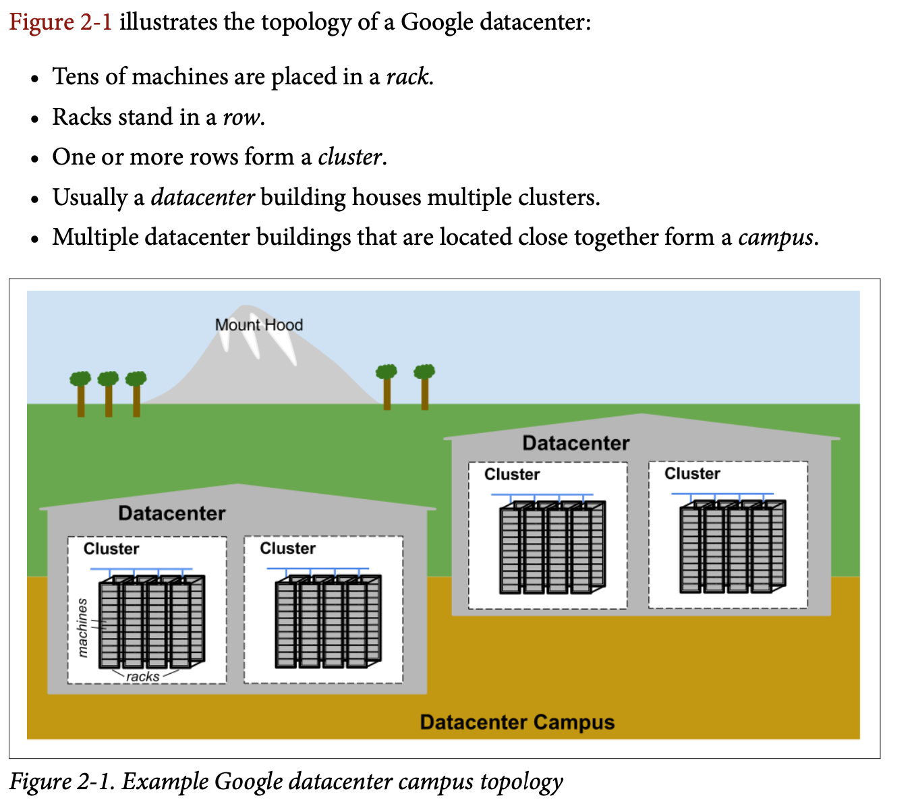
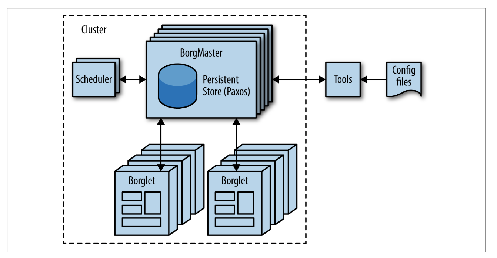
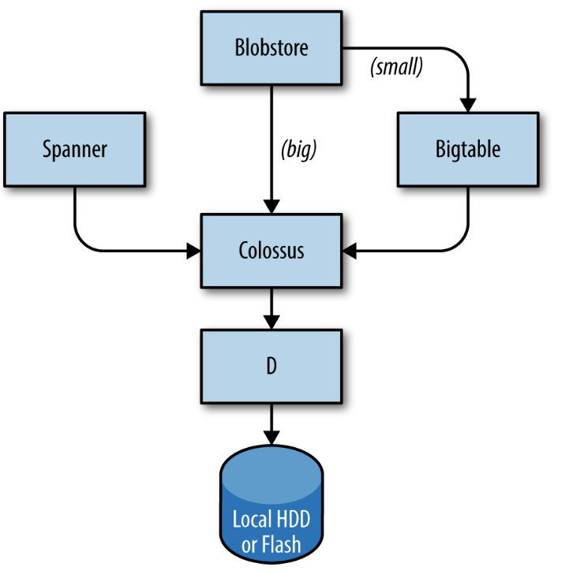
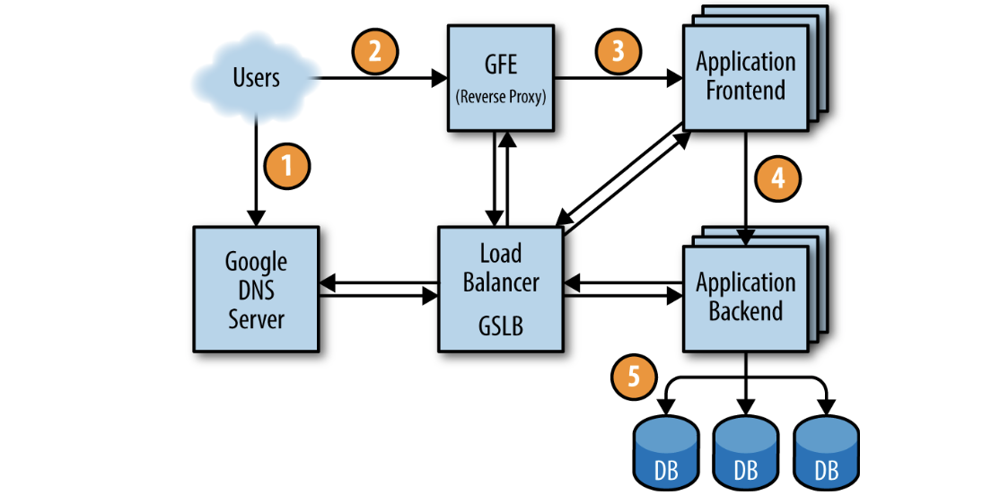

## The Production Environment at Google

### Hardware

Most of Google’s compute resources are in Google-designed datacenters with proprietary power distribution, cooling, networking, and compute hardware. Unlike “standard” colocation datacenters, the compute hardware in a Google-designed datacenter is the same across the board.

### System Software That “Organizes” the Hardware

Our hardware must be controlled and administered by software that can handle mas‐ sive scale. Hardware failures are one notable problem that we manage with software. Given the large number of hardware components in a cluster, hardware failures occur quite frequently. In a single cluster in a typical year, thousands of machines fail and thousands of hard disks break; when multiplied by the number of clusters we operate globally, these numbers become somewhat breathtaking. Therefore, we want to abstract such problems away from users, and the teams running our services similarly don’t want to be bothered by hardware failures. Each datacenter campus has teams dedicated to maintaining the hardware and datacenter infrastructure.

#### Managing Machines

Borg is responsible for running users’ jobs, which can either be indefinitely running servers or batch processes like a MapReduce. Jobs can consist of more than one (and sometimes thousands) of identical tasks, both for reasons of reliability and because a single process can’t usually handle all cluster traffic. When Borg starts a job, it finds machines for the tasks and tells the machines to start the server program. Borg then continually monitors these tasks. If a task malfunctions, it is killed and restarted, possibly on a different machine.

We solve this problem with an extra level of indirection: when starting a job, Borg allocates a name and index number to each task using the Borg Naming Service (BNS).

#### Storage

The storage layer is responsible for offering users easy and reliable access to the stor‐ age available for a cluster. 

1. The lowest layer is called D (for disk, although D uses both spinning disks and flash storage). D is a fileserver running on almost all machines in a cluster. How‐ ever, users who want to access their data don’t want to have to remember which machine is storing their data, which is where the next layer comes into play.
2. A layer on top of D called Colossus creates a cluster-wide filesystem that offers usual filesystem semantics, as well as replication and encryption. Colossus is the successor to GFS, the Google File System.
3. There are several database-like services built on top of Colossus:
 a. Bigtable  is a NoSQL database system that can handle databases that are petabytes in size. A Bigtable is a sparse, distributed, persistent multidi‐ mensional sorted map that is indexed by row key, column key, and timestamp; each value in the map is an uninterpreted array of bytes. Bigtable supports eventually consistent, cross-datacenter replication.
 b. Spanner offers an SQL-like interface for users that require real con‐ sistency across the world.
 c. Several other database systems, such as Blobstore, are available. Each of these options comes with its own set of trade-offs (see Chapter 26).

#### Networking

Some services have jobs running in multiple clusters, which are distributed across the world. In order to minimize latency for globally distributed services, we want to direct users to the closest datacenter with available capacity. Our Global Software Load Balancer (GSLB) performs load balancing on three levels:

- Geographic load balancing for DNS requests (for example, to www.google.com)
- Load balancing at a user service level (for example, YouTube or Google Maps)
- Load balancing at the Remote Procedure Call (RPC) level

### Other System Software

#### Lock Service

The Chubby lock service provides a filesystem-like API for maintaining locks. Chubby handles these locks across datacenter locations. 

Chubby also plays an important role in master election. 

Data that must be consistent is well suited to storage in Chubby. 

#### Monitoring and Alerting

We want to make sure that all services are running as required. We can use monitoring in several ways:

- Set up alerting for acute problems.
- Compare behavior: did a software update make the server faster?
- Examine how resource consumption behavior evolves over time, which is essential for capacity planning.

### Our Software Infrastructure

Our software architecture is designed to make the most efficient use of our hardware infrastructure. Our code is heavily multithreaded, so one task can easily use many cores. To facilitate dashboards, monitoring, and debugging, every server has an HTTP server that provides diagnostics and statistics for a given task.

All of Google’s services communicate using a Remote Procedure Call (RPC) infra‐ structure named Stubby; an open source version, gRPC, is available.

### Our Development Environment

Development velocity is very important to Google, so we’ve built a complete development environment to make use of our infrastructure.

- If engineers encounter a problem in a component outside of their project, they can fix the problem, send the proposed changes (“changelist,” or CL) to the owner for review, and submit the CL to the mainline.
- Changes to source code in an engineer’s own project require a review. All soft‐ ware is reviewed before being submitted.

### Shakespeare: A Sample Service

To provide a model of how a service would hypothetically be deployed in the Google production environment, let’s look at an example service that interacts with multiple Google technologies. 

We can divide this system into two parts:
- A batch component that reads all of Shakespeare’s texts, creates an index, and writes the index into a Bigtable. This job need only run once, or perhaps very infrequently (as you never know if a new text might be discovered!).
- An application frontend that handles end-user requests. This job is always up, as users in all time zones will want to search in Shakespeare’s books.

### Life of a Request

first, the user points their browser to shakespeare.google.com. To obtain the corresponding IP address, the user’s device resolves the address with its DNS server (1). This request ultimately ends up at Goo‐ gle’s DNS server, which talks to GSLB. As GSLB keeps track of traffic load among frontend servers across regions, it picks which server IP address to send to this user.

The browser connects to the HTTP server on this IP. This server (named the Google Frontend, or GFE) is a reverse proxy that terminates the TCP connection (2). The GFE looks up which service is required (web search, maps, or—in this case—Shakespeare). Again using GSLB, the server finds an available Shakespeare frontend server, and sends that server an RPC containing the HTML request (3).

The Shakespeare server analyzes the HTML request and constructs a protobuf containing the word to look up. The Shakespeare frontend server now needs to contact the Shakespeare backend server: the frontend server contacts GSLB to obtain the BNS address of a suitable and unloaded backend server (4). That Shakespeare backend server now contacts a Bigtable server to obtain the requested data (5).

The answer is written to the reply protobuf and returned to the Shakespeare backend server. The backend hands a protobuf containing the results to the Shakespeare frontend server, which assembles the HTML and returns the answer to the user.

This entire chain of events is executed in the blink of an eye—just a few hundred milliseconds! Because many moving parts are involved, there are many potential points of failure; in particular, a failing GSLB would wreak havoc. However, Google’s policies of rigorous testing and careful rollout, in addition to our proactive error recovery methods such as graceful degradation, allow us to deliver the reliable service that our users have come to expect. After all, people regularly use www.google.com to check if their Internet connection is set up correctly.

### Job and Data Organization

Load testing determined that our backend server can handle about 100 queries per second (QPS).

- During updates, one task at a time will be unavailable, leaving 36 tasks.
- A machine failure might occur during a task update, leaving only 35 tasks, just enough to serve peak load.